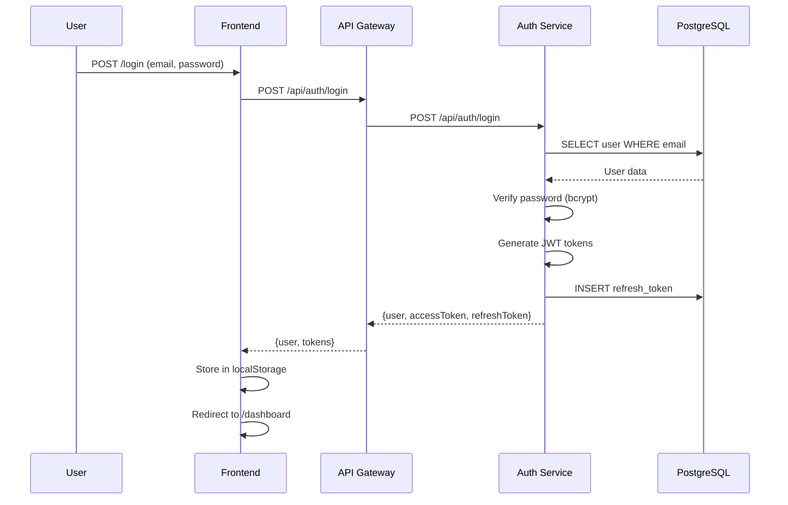
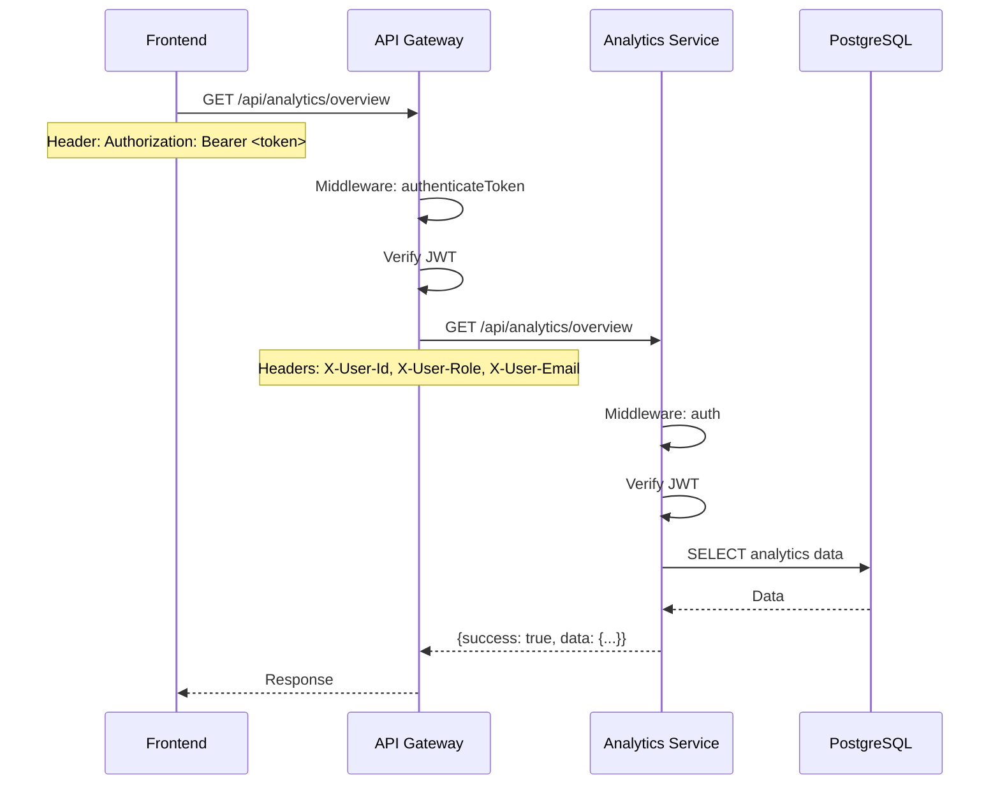
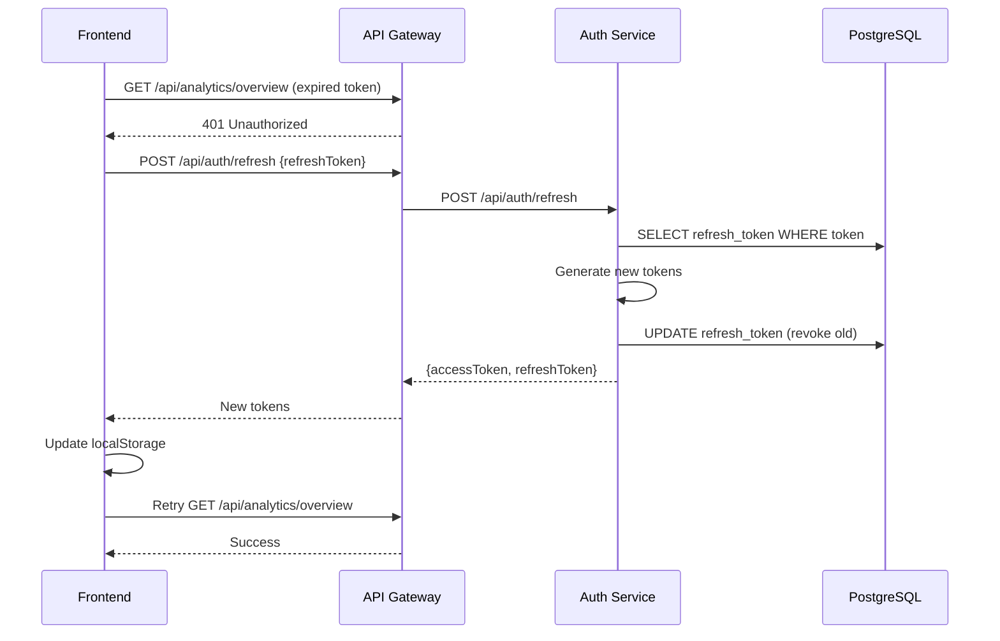

# 🔧 DOCUMENTATION TECHNIQUE - Parabellum ERP

## Table des matières
1. [Architecture du système](#1-architecture-du-système)
2. [Système d'autorisation](#2-système-dautorisation)
3. [Flux de données](#3-flux-de-données)
4. [Problèmes actuels et solutions](#4-problèmes-actuels-et-solutions)
5. [Guide d'implémentation RBAC](#5-guide-dimplémentation-rbac)

---

## 1. Architecture du système

### Stack technique

**Frontend** :
- Next.js 16.1.6 (App Router)
- React 19
- TypeScript
- TailwindCSS
- React Query (cache & state)
- Axios (HTTP client)

**Backend - API Gateway** :
- Express.js
- http-proxy-middleware
- Rate limiting (express-rate-limit + Redis)
- JWT authentication
- Port : 3001

**Backend - Microservices** (12 services) :
- Node.js + Express
- Prisma ORM
- PostgreSQL (base par service)
- Ports : 4001-4012

**Infra** :
- Docker + Docker Compose
- PostgreSQL 16
- Redis 7

### Architecture microservices

```
┌─────────────┐
│  Frontend   │ Port 3000
│  (Next.js)  │
└──────┬──────┘
       │
       ↓
┌─────────────────────┐
│   API Gateway       │ Port 3001
│   (Reverse Proxy)   │
└──────┬──────────────┘
       │
       ├→ auth-service          (4001)  ← JWT, Users, Roles, Permissions
       ├→ communication-service (4002)  ← Messages, Emails
       ├→ technical-service     (4003)  ← Missions, Interventions
       ├→ commercial-service    (4004)  ← Prospects, CRM
       ├→ inventory-service     (4005)  ← Stock, Équipements
       ├→ project-service       (4006)  ← Projets, Tâches
       ├→ procurement-service   (4007)  ← Achats, Fournisseurs
       ├→ customer-service      (4008)  ← Clients, Contacts
       ├→ hr-service            (4009)  ← RH, Paie, Congés
       ├→ billing-service       (4010)  ← Factures, Paiements
       ├→ analytics-service     (4011)  ← KPIs, Rapports
       └→ notification-service  (4012)  ← Notifications push
```

### Base de données

**12 bases PostgreSQL** (une par microservice) :
- `parabellum_auth` - Utilisateurs, rôles, permissions
- `parabellum_communication` - Messages, templates
- `parabellum_technical` - Missions, techniciens
- `parabellum_commercial` - Prospects
- `parabellum_inventory` - Stock, équipements
- `parabellum_projects` - Projets, tâches
- `parabellum_procurement` - Achats, fournisseurs
- `parabellum_customers` - Clients, contacts
- `parabellum_hr` - Employés, paie
- `parabellum_billing` - Factures, paiements
- `parabellum_Analytics` - Métriques, KPIs
- `delices_db` - Notifications

---

## 2. Système d'autorisation

### Modèle de données (auth-service)

#### Tables principales

**`users`** - Utilisateurs
```sql
id, email, password_hash,
firstName, lastName,
roleId → roles(id),
serviceId → services(id),
isActive, permissions (LEGACY STRING - À SUPPRIMER)
```

**`roles`** - Rôles
```sql
id, name, code, description,
isSystem, isActive
```

**`permissions`** - Permissions
```sql
id, name, description, category
Format: category.action (ex: "users.read")
```

**`role_permissions`** - Permissions par rôle
```sql
id, roleId, permissionId,
canView, canCreate, canEdit, canDelete, canApprove
UNIQUE(roleId, permissionId)
```

**`user_permissions`** - Surcharges utilisateur
```sql
id, user_id, permission_id,
can_view, can_create, can_edit, can_delete, can_approve
UNIQUE(user_id, permission_id)
```

### Hiérarchie des permissions

```
1. Permissions du rôle (RolePermission)
   ↓ (base)
2. Permissions utilisateur (UserPermission)
   ↓ (override)
3. Permissions effectives
```

**Règle de résolution** :
- Si l'utilisateur a une permission spécifique → **utiliser UserPermission**
- Sinon → utiliser RolePermission du rôle
- Si aucune permission trouvée → **accès refusé**

### Actions granulaires

Pour chaque ressource, 5 actions possibles :

| Action | Champ DB | Description |
|--------|----------|-------------|
| **View** | `canView` / `can_view` | Consulter les données |
| **Create** | `canCreate` / `can_create` | Créer de nouvelles entrées |
| **Edit** | `canEdit` / `can_edit` | Modifier des données |
| **Delete** | `canDelete` / `can_delete` | Supprimer des données |
| **Approve** | `canApprove` / `can_approve` | Valider/Approuver |

### Rôles par défaut

#### Administrateur (`ADMIN`)
- `code`: "ADMIN"
- `id`: 1
- **Permissions** : TOUTES (bypass automatique)

#### Employé (`EMPLOYEE`)
- `code`: "EMPLOYEE"
- `id`: 2
- **Permissions** : Limitées (dashboard, quelques lectures)

### Permissions disponibles

**Catégories** :
```javascript
const permissionCategories = {
  dashboard: ['view', 'analytics'],
  users: ['read', 'create', 'update', 'delete'],
  roles: ['read', 'create', 'update', 'delete'],
  services: ['read', 'create', 'update', 'delete'],
  permissions: ['read', 'manage'],
  customers: ['read', 'create', 'update', 'delete'],
  invoices: ['read', 'create', 'update', 'delete', 'approve'],
  // ... etc pour chaque module
};
```

---

## 3. Flux de données

### Authentification



### Requête authentifiée



### Refresh token



---

## 4. Problèmes actuels et solutions

### 🐛 BUG #1 : Backend n'envoie pas les permissions

**Fichier** : `services/auth-service/src/controllers/auth.controller.js`  
**Lignes** : 134-150 (login), 394-430 (getCurrentUser)

**Problème** :
```javascript
const user = await prisma.user.findUnique({
  where: { email },
  include: {
    service: { select: { id: true, name: true } },
    role: { select: { id: true, name: true } }, // ❌ PAS de rolePermissions !
  }
});
```

**Solution** :
```javascript
const user = await prisma.user.findUnique({
  where: { email },
  include: {
    service: { select: { id: true, name: true } },
    role: {
      select: {
        id: true, name: true, code: true,
        rolePermissions: {  // ✅ AJOUTER
          include: { permission: true }
        }
      }
    },
    user_permissions: {  // ✅ AJOUTER
      include: { permission: true }
    }
  }
});
```

### 🐛 BUG #2 : Frontend n'a pas le type User avec permissions

**Fichier** : `frontend/src/shared/api/shared/types.ts`  
**Lignes** : 125-137

**Problème** :
```typescript
export interface User {
  id: string;
  email: string;
  role: UserRole; // ❌ Simple enum, pas d'objet
  // ❌ PAS de permissions !
}
```

**Solution** :
```typescript
export interface Permission {
  id: number;
  name: string;
  category: string;
  description?: string;
}

export interface RolePermission {
  id: number;
  permissionId: number;
  permission: Permission;
  canView: boolean;
  canCreate: boolean;
  canEdit: boolean;
  canDelete: boolean;
  canApprove: boolean;
}

export interface UserPermission {
  id: number;
  permission_id: number;
  permission: Permission;
  can_view: boolean;
  can_create: boolean;
  can_edit: boolean;
  can_delete: boolean;
  can_approve: boolean;
}

export interface Role {
  id: number;
  name: string;
  code: string;
  rolePermissions?: RolePermission[]; // ✅ AJOUTER
}

export interface User {
  id: string;
  email: string;
  firstName: string;
  lastName: string;
  role?: Role; // ✅ Objet complet
  roleId?: number;
  user_permissions?: UserPermission[]; // ✅ AJOUTER
  isActive: boolean;
  // ... autres champs
}
```

### 🐛 BUG #3 : hasAccess() est un stub

**Fichier** : `frontend/src/components/layout/Sidebar.tsx`  
**Lignes** : 310-315

**Problème** :
```typescript
const hasAccess = useCallback((item: NavigationItem) => {
  if (!item.permission) return true;
  if (isAdmin) return true;
  return true; // ❌ TOUJOURS TRUE !
}, [isAdmin]);
```

**Solution** :
```typescript
import { hasPermission } from '@/shared/utils/permissions';

const hasAccess = useCallback((item: NavigationItem) => {
  if (!item.permission) return true;
  if (!user) return false;
  if (user.role?.code === 'ADMIN') return true;
  
  // ✅ Vérifier la permission réelle
  return hasPermission(user, item.permission, 'view');
}, [user]);
```

### 🐛 BUG #4 : Pas d'utilitaire de vérification

**Fichier** : `frontend/src/shared/utils/permissions.ts` (N'EXISTE PAS)

**Solution** : Créer le fichier (voir section 5)

---

## 5. Guide d'implémentation RBAC

### Étape 1 : Créer les utilitaires frontend

**Fichier** : `frontend/src/shared/utils/permissions.ts`

```typescript
import { User, Permission, RolePermission, UserPermission } from '@/shared/api/shared/types';

type PermissionAction = 'view' | 'create' | 'edit' | 'delete' | 'approve';

/**
 * Vérifie si l'utilisateur a une permission spécifique
 */
export function hasPermission(
  user: User | null,
  permissionName: string,
  action: PermissionAction = 'view'
): boolean {
  if (!user) return false;
  
  // Admin bypass
  if (user.role?.code === 'ADMIN') return true;
  
  // 1. Chercher dans user_permissions (priorité)
  const userPerm = user.user_permissions?.find(
    (up) => up.permission.name === permissionName
  );
  
  if (userPerm) {
    const actionKey = `can_${action}` as keyof UserPermission;
    return userPerm[actionKey] as boolean || false;
  }
  
  // 2. Chercher dans role.rolePermissions
  const rolePerm = user.role?.rolePermissions?.find(
    (rp) => rp.permission.name === permissionName
  );
  
  if (rolePerm) {
    const actionKey = `can${action.charAt(0).toUpperCase()}${action.slice(1)}` as keyof RolePermission;
    return rolePerm[actionKey] as boolean || false;
  }
  
  return false;
}

/**
 * Vérifie si l'utilisateur a AU MOINS UNE permission dans une catégorie
 */
export function hasAnyPermissionInCategory(
  user: User | null,
  category: string
): boolean {
  if (!user) return false;
  if (user.role?.code === 'ADMIN') return true;
  
  const hasUserPerm = user.user_permissions?.some(
    (up) => up.permission.category === category &&
            (up.can_view || up.can_create || up.can_edit || up.can_delete || up.can_approve)
  );
  
  const hasRolePerm = user.role?.rolePermissions?.some(
    (rp) => rp.permission.category === category &&
            (rp.canView || rp.canCreate || rp.canEdit || rp.canDelete || rp.canApprove)
  );
  
  return hasUserPerm || hasRolePerm || false;
}

/**
 * Récupère toutes les permissions effectives de l'utilisateur (fusionnées)
 */
export function getUserPermissions(user: User | null) {
  const permissionsMap = new Map<string, {
    permission: Permission;
    canView: boolean;
    canCreate: boolean;
    canEdit: boolean;
    canDelete: boolean;
    canApprove: boolean;
  }>();
  
  if (!user) return permissionsMap;
  
  // Ajouter les permissions du rôle
  user.role?.rolePermissions?.forEach((rp) => {
    permissionsMap.set(rp.permission.name, {
      permission: rp.permission,
      canView: rp.canView,
      canCreate: rp.canCreate,
      canEdit: rp.canEdit,
      canDelete: rp.canDelete,
      canApprove: rp.canApprove,
    });
  });
  
  // Override avec les permissions utilisateur
  user.user_permissions?.forEach((up) => {
    permissionsMap.set(up.permission.name, {
      permission: up.permission,
      canView: up.can_view,
      canCreate: up.can_create,
      canEdit: up.can_edit,
      canDelete: up.can_delete,
      canApprove: up.can_approve,
    });
  });
  
  return permissionsMap;
}
```

### Étape 2 : Créer un composant PermissionGuard

**Fichier** : `frontend/src/components/auth/PermissionGuard.tsx`

```typescript
import { ReactNode } from 'react';
import { useAuth } from '@/shared/hooks/useAuth';
import { hasPermission } from '@/shared/utils/permissions';

interface PermissionGuardProps {
  permission: string;
  action?: 'view' | 'create' | 'edit' | 'delete' | 'approve';
  fallback?: ReactNode;
  children: ReactNode;
}

export function PermissionGuard({
  permission,
  action = 'view',
  fallback = null,
  children,
}: PermissionGuardProps) {
  const { user } = useAuth();
  
  if (!hasPermission(user, permission, action)) {
    return <>{fallback}</>;
  }
  
  return <>{children}</>;
}
```

**Usage** :
```tsx
<PermissionGuard permission="users.create" action="create">
  <Button>Créer un utilisateur</Button>
</PermissionGuard>

<PermissionGuard permission="invoices.delete" action="delete" fallback={<div>Accès refusé</div>}>
  <DeleteButton />
</PermissionGuard>
```

### Étape 3 : Middleware backend de vérification

**Fichier** : `services/auth-service/src/middleware/checkPermission.js`

```javascript
const prisma = require('../config/database');

const checkPermission = (permissionName, action = 'view') => {
  return async (req, res, next) => {
    const user = req.user;
    
    // Admin bypass
    if (user.role?.code === 'ADMIN') {
      return next();
    }
    
    // Récupérer la permission
    const permission = await prisma.permission.findUnique({
      where: { name: permissionName }
    });
    
    if (!permission) {
      return res.status(403).json({
        success: false,
        message: 'Permission not found'
      });
    }
    
    // Vérifier user_permissions en priorité
    const userPerm = await prisma.userPermission.findUnique({
      where: {
        user_id_permission_id: {
          user_id: user.id,
          permission_id: permission.id
        }
      }
    });
    
    if (userPerm) {
      const actionMap = {
        view: userPerm.can_view,
        create: userPerm.can_create,
        edit: userPerm.can_edit,
        delete: userPerm.can_delete,
        approve: userPerm.can_approve
      };
      
      if (actionMap[action]) {
        return next();
      }
    }
    
    // Vérifier role_permissions
    const rolePerm = await prisma.rolePermission.findUnique({
      where: {
        roleId_permissionId: {
          roleId: user.roleId,
          permissionId: permission.id
        }
      }
    });
    
    if (rolePerm) {
      const actionMap = {
        view: rolePerm.canView,
        create: rolePerm.canCreate,
        edit: rolePerm.canEdit,
        delete: rolePerm.canDelete,
        approve: rolePerm.canApprove
      };
      
      if (actionMap[action]) {
        return next();
      }
    }
    
    // Aucune permission trouvée
    return res.status(403).json({
      success: false,
      message: 'Insufficient permissions'
    });
  };
};

module.exports = { checkPermission };
```

**Usage** :
```javascript
const { checkPermission } = require('../middleware/checkPermission');

// Protéger une route
router.get('/users', 
  authenticateToken, 
  checkPermission('users.read', 'view'),
  userController.getAll
);

router.post('/users',
  authenticateToken,
  checkPermission('users.create', 'create'),
  userController.create
);

router.delete('/users/:id',
  authenticateToken,
  checkPermission('users.delete', 'delete'),
  userController.delete
);
```

### Étape 4 : Checklist d'implémentation

#### Backend
- [ ] Modifier `auth.controller.js` login() pour inclure `rolePermissions` + `user_permissions`
- [ ] Modifier `auth.controller.js` getCurrentUser() idem
- [ ] Créer `middleware/checkPermission.js`
- [ ] Appliquer le middleware aux routes protégées
- [ ] Tester avec Postman/curl

#### Frontend
- [ ] Modifier `types.ts` pour ajouter Permission, RolePermission, UserPermission
- [ ] Créer `utils/permissions.ts` avec hasPermission, etc.
- [ ] Créer `components/auth/PermissionGuard.tsx`
- [ ] Modifier `Sidebar.tsx` pour utiliser hasPermission()
- [ ] Ajouter PermissionGuard sur les boutons CRUD
- [ ] Tester avec compte admin et compte employé

#### Tests
- [ ] Admin voit tout
- [ ] Employé voit menu limité
- [ ] User avec permission custom voit éléments spécifiques
- [ ] Requête API sans permission → 403
- [ ] Bouton "Supprimer" masqué si pas `canDelete`

---

## 📚 Ressources

### Documentation externe
- [Prisma ORM](https://www.prisma.io/docs)
- [Next.js App Router](https://nextjs.org/docs/app)
- [React Query](https://tanstack.com/query/latest/docs/framework/react/overview)
- [JWT.io](https://jwt.io/)

### Fichiers clés du projet
- `services/auth-service/prisma/schema.prisma` - Schéma DB
- `services/auth-service/src/controllers/auth.controller.js` - Authentification
- `services/auth-service/src/controllers/user-permission.controller.js` - Gestion permissions
- `services/api-gateway/routes/services/*.routes.js` - Configuration proxy
- `frontend/src/components/layout/Sidebar.tsx` - Menu navigation
- `frontend/src/shared/providers/AuthProvider.tsx` - Context auth

---

**Version** : 1.0  
**Date** : Février 2026  
**Auteur** : Équipe Parabellum ERP
