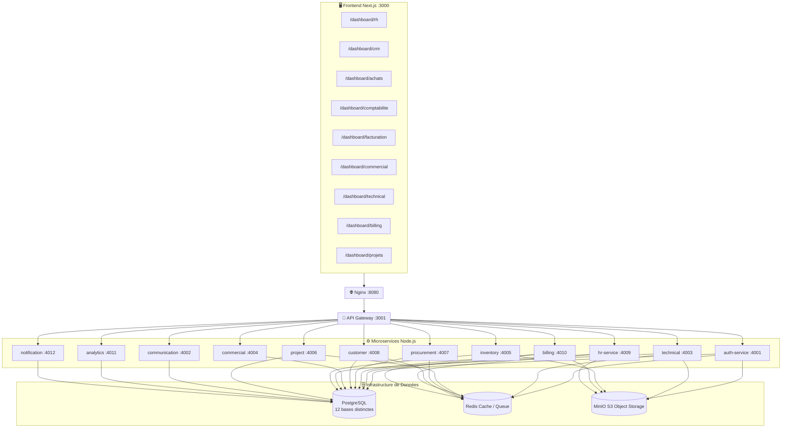
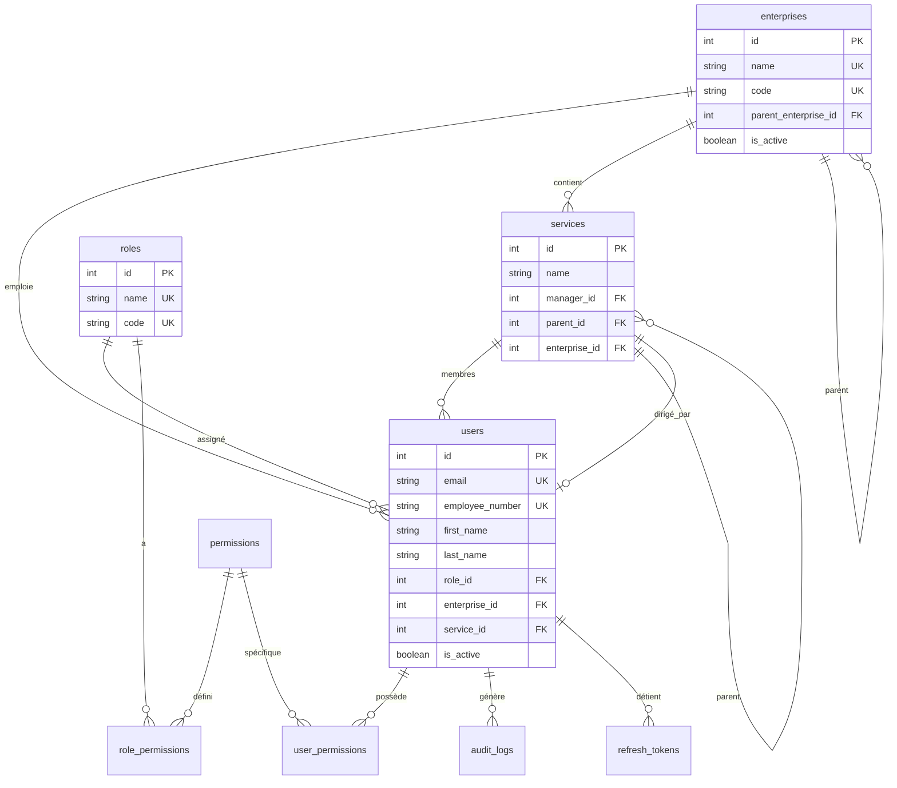
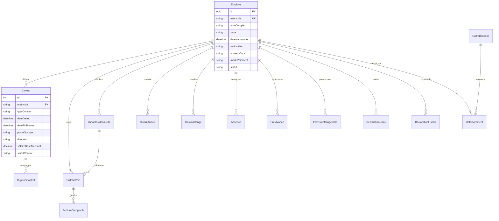
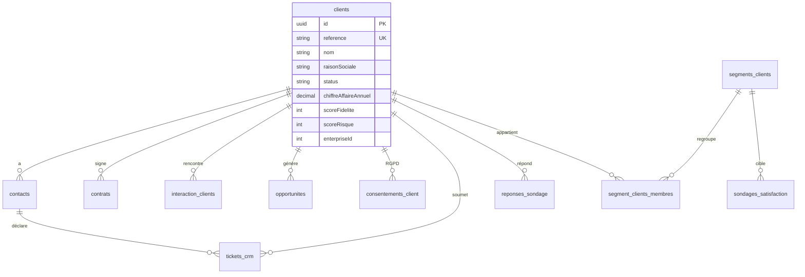
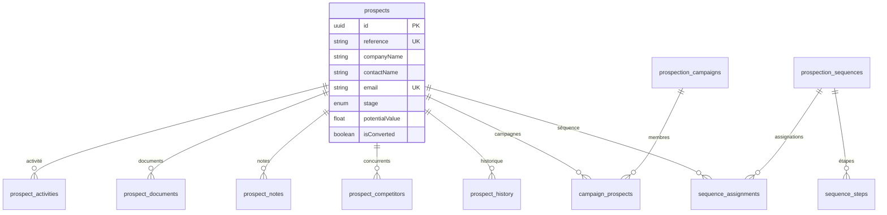
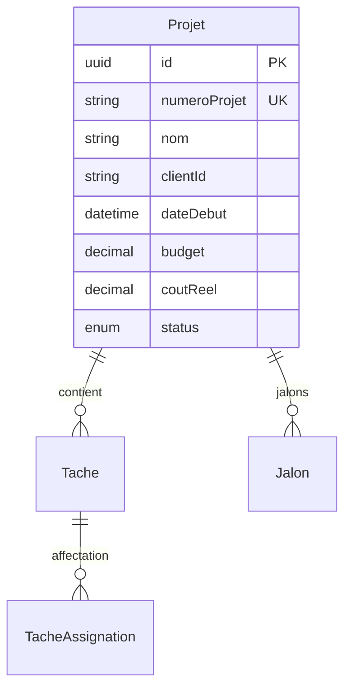
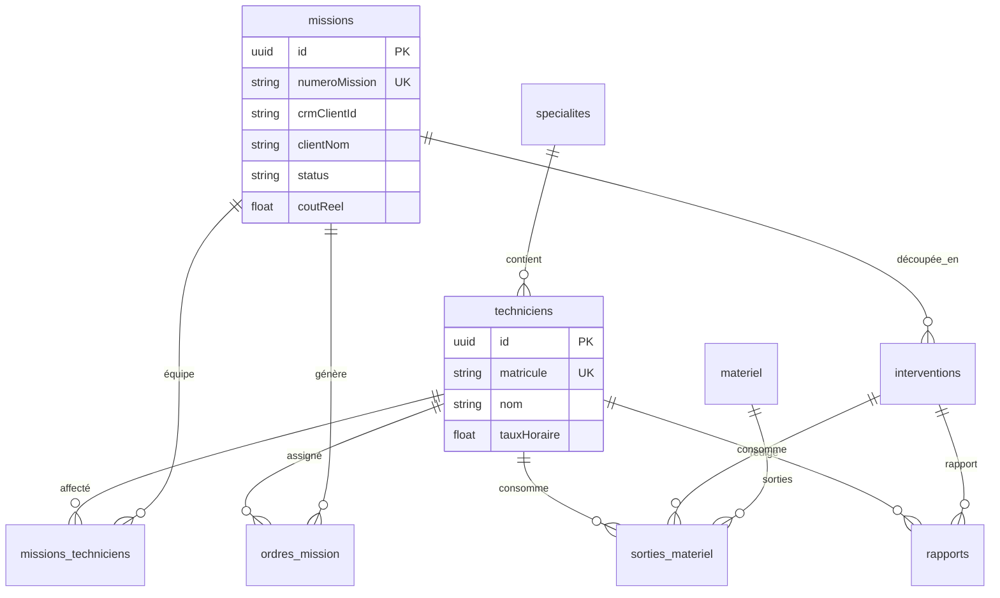
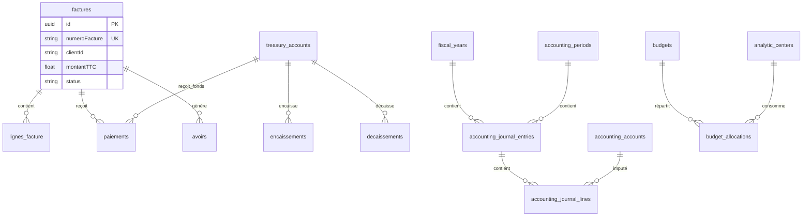
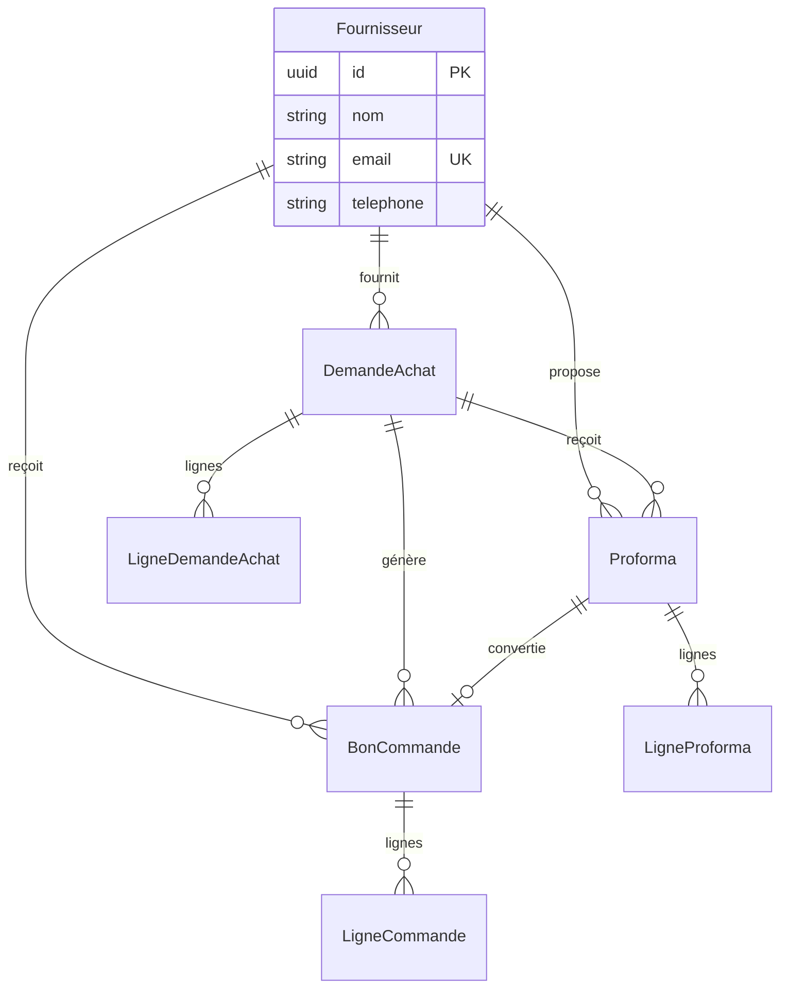

# 🏗️ DOCUMENT DE RÉFÉRENCE TECHNIQUE & SQL EXTRACTION
## SYSTÈME ERP MICROSERVICES PARABELLUM GROUPS

Ce document de référence absolue regroupe et consolide l'ensemble des analyses architecturales, des cartographies de bases de données, des schémas de relations d'entités (ERD) et de la bibliothèque ultime de requêtes d'extraction SQL pour le projet microservices **Parabellum Groups**.

---

## SOMMAIRE
1. **Architecture Globale du Système & Stack Technique**
2. **Schéma Mermaid d'Architecture Système**
3. **Cartographie des 12 Bases de Données & Services**
4. **Matrice de Flux Cross-Services & Clés de Jointure**
5. **Schémas ER (Relations d'Entités) Détaillés par Service**
   - *A. Authentification & Structure (`parabellum_auth`)*
   - *B. Ressources Humaines & Paie SYSCOHADA (`parabellum_hr`)*
   - *C. Gestion Client, Tickets Support & NPS (`parabellum_customers`)*
   - *D. Commercial, Campagnes & Séquences (`parabellum_commercial`)*
   - *E. Gestion de Projets, Tâches & Jalons (`parabellum_projects`)*
   - *F. Maintenance Technique, Chantiers & Techniciens (`parabellum_technical`)*
   - *G. Facturation, Devis, Trésorerie & Comptabilité SYSCOHADA (`parabellum_billing`)*
   - *H. Achats & Approvisionnements (`parabellum_procurement`)*
6. **Bibliothèque Ultime de Requêtes SQL Prêtes à l'Emploi**
   - *A. Module Ressources Humaines (17 Requêtes)*
   - *B. Module CRM & Service Client (12 Requêtes)*
   - *C. Module Commercial & Acquisition (5 Requêtes)*
   - *D. Module Gestion de Projets (5 Requêtes)*
   - *E. Module Achats & Procurement (8 Requêtes)*
   - *F. Module Maintenance & Interventions Techniques (5 Requêtes)*
   - *G. Module Facturation, Trésorerie & Comptabilité (18 Requêtes)*

---

## 1. ARCHITECTURE GLOBALE DU SYSTÈME & STACK TECHNIQUE

Le projet **Parabellum ERP** repose sur une architecture moderne de microservices isolés et conteneurisés.

- **Frontend** : Next.js (port `3000`), structuré autour de modules spécifiques dans `app/(dashboard)/dashboard/...` (e.g. `/rh`, `/crm`, `/achats`, `/comptabilite`, `/billing`, `/technical`, `/projets`).
- **Nginx & API Gateway** : Passerelle d'API centralisée (port `3001`) assurant le routage des requêtes externes vers les microservices.
- **Bases de Données** : Une instance unique PostgreSQL (v15-alpine) hébergeant **12 bases de données logiques isolées**. Chaque service possède sa propre base et communique de manière asynchrone ou via des appels API gérés.
- **Stockage & Cache** :
  - **MinIO** : Serveur de stockage d'objets compatible S3 pour les fichiers (bulletins de paie, documents de contrats, factures, pièces jointes techniques).
  - **Redis** : Base de données en mémoire pour le cache des sessions et la gestion des files d'attente de messages.

---

## 2. SCHÉMA MERMAID D'ARCHITECTURE SYSTÈME

Le diagramme suivant illustre le flux allant de l'interface utilisateur vers les services de données et de stockage.



---

## 3. CARTOGRAPHIE DES 12 BASES DE DONNÉES & SERVICES

Voici la liste des bases de données Postgres instanciées au démarrage et leur rôle correspondant :

| Nom de la Base | Microservice associé | Port | Description et Données principales |
| :--- | :--- | :--- | :--- |
| `parabellum_auth` | `auth-service` | `4001` | Utilisateurs, rôles, permissions, filiales et entités. |
| `parabellum_communication` | `communication-service` | `4002` | Canaux, SMS, modèles de mails, publipostage. |
| `parabellum_technical` | `technical-service` | `4003` | Techniciens, ordres de mission, interventions sur site. |
| `parabellum_commercial` | `commercial-service` | `4004` | Leads, prospects, campagnes d'acquisition, pipelines. |
| `parabellum_inventory` | `inventory-service` | `4005` | Articles, mouvements de stock, réceptions de produits. |
| `parabellum_projects` | `project-service` | `4006` | Projets clients, jalons, tâches et feuilles de temps. |
| `parabellum_procurement` | `procurement-service` | `4007` | Demandes d'achat, comparatifs proformas, bons de commande. |
| `parabellum_customers` | `customer-service` | `4008` | Fiche client 360°, contrats CRM, tickets support, NPS. |
| `parabellum_hr` | `hr-service` | `4009` | Employés, contrats de travail, variables de paie, bulletins. |
| `parabellum_billing` | `billing-service` | `4010` | Invoicing, comptabilité OHADA, budgets, trésorerie, placements. |
| `parabellum_Analytics` | `analytics-service` | `4011` | Données consolidées pour l'aide à la décision (KPIs). |
| `parabellum_notification` | `notification-service` | `4012` | Logs d'envois de notifications push et mails système. |

---

## 4. MATRICE DE FLUX CROSS-SERVICES & CLÉS DE JOINTURE

Les microservices utilisant des bases de données isolées physiques, les jointures standard `JOIN` en SQL direct ne sont pas exécutables si l'on n'utilise pas des liaisons d'API, des passerelles ou des mécanismes de stockage fédérés. 

Le tableau ci-dessous explicite les identifiants clés permettant de réconcilier les données d'une base à une autre dans des outils d'analytics de type ETL ou Datawarehouse :

| Clé logique globale | Service émetteur | Services récepteurs | Rôle et correspondance |
| :--- | :--- | :--- | :--- |
| `matricule` | `hr-service` | `auth-service` | Fait le pont entre l'utilisateur applicatif (`users.employee_number`) et le collaborateur (`Employe.matricule`). |
| `userId` / `createdBy` | `auth-service` | *Tous les services* | Lie chaque création d'écriture, de bon de caisse ou de ticket à un utilisateur de la table `users.id`. |
| `enterpriseId` | `auth-service` | `billing`, `procurement`, `customers`, `technical` | Permet le cloisonnement multi-société / multi-filiale (`enterprises.id`). |
| `serviceId` | `auth-service` | `billing` (budgets), `procurement` | Identifie le département interne rattaché à une direction (`services.id`). |
| `clientId` | `customer-service` | `billing-service`, `technical-service` | Clé d'identification client (`clients.id`). Dans `billing.factures` ou `technical.Mission`. |
| `prospectId` | `commercial-service` | `customer-service` | Traceur d'opportunité commerciale convertie en client. |
| `fournisseurId` | `procurement-service` | `billing-service` | Relie la fiche fournisseur d'achats (`fournisseurs.id`) à la facture fournisseur reçue. |
| `bonCommandeId` | `procurement-service`| `inventory-service` | Associe le bon d'achat (`bons_commande.id`) à la réception physique de marchandises en stock. |

---

## 5. SCHÉMAS ER (RELATIONS D'ENTITÉS) DÉTAILLÉS PAR SERVICE

### 🔐 A. Authentification & Structure (`parabellum_auth`)
Gère la structure organisationnelle du groupe (entreprises/filiales, services) et les habilitations des collaborateurs.


---

### 👥 B. Ressources Humaines & Paie SYSCOHADA (`parabellum_hr`)
Modélise la fiche de l'employé, l'historique de ses contrats, le calcul mensuel de la paie et les déclarations administratives de l'Afrique de l'Ouest (CNPS, fisc).


---

### 🤝 C. Gestion Client, Tickets Support & NPS (`parabellum_customers`)
Ce schéma englobe les clients, leurs contrats-cadres récurrents, le support par tickets et les enquêtes de satisfaction (NPS).


---

### 📣 D. Commercial, Campagnes & Séquences (`parabellum_commercial`)
Gère le pipeline commercial (Prospects), les campagnes, les séquences de prospection automatiques et les objectifs de ventes.


---

### 🏗️ E. Gestion de Projets, Tâches & Jalons (`parabellum_projects`)
Modélise la vie opérationnelle des chantiers et projets : répartition des tâches, planification et livraisons.


---

### 🛠️ F. Maintenance Technique, Chantiers & Techniciens (`parabellum_technical`)
Gère les plannings techniques, les bons d'ordres de mission, le matériel consommé en chantier et les rapports.


---

### 🗃️ G. Facturation, Devis, Trésorerie & Comptabilité SYSCOHADA (`parabellum_billing`)
La structure financière de facturation, comptabilité de tiers, de rapprochement bancaire SYSCOHADA, gestion budgétaire et placements.


---

### 🛒 H. Achats & Approvisionnements (`parabellum_procurement`)
Gère les fournisseurs, les demandes d'achat internes, les proformas comparatifs et les bons de commande d'achat.


---

## 6. BIBLIOTHÈQUE ULTIME DE REQUÊTES SQL PRÊTES À L'EMPLOI

Les requêtes suivantes sont adaptées aux schémas Prisma réels.

### 👥 A. Module Ressources Humaines (`parabellum_hr`)

#### RH-01 : Effectifs actifs avec leur contrat en cours de validité
```sql
SELECT e.matricule, e."nomComplet", e.sexe, e."dateNaissance",
       e."telephonePersonnel", e."emailPersonnel", e.statut,
       c."posteOccupe", c.direction, c.service,
       c."typeContrat", c."dateDebut", c."salaireBaseMensuel"
FROM "Employe" e
LEFT JOIN "Contrat" c ON c.matricule = e.matricule AND c."statutContrat" = 'ACTIF'
WHERE e.statut = 'ACTIF'
ORDER BY e."nomComplet";
```

#### RH-02 : Masse salariale et coûts employeur mensuels par Direction
```sql
SELECT c.direction,
       COUNT(DISTINCT e.matricule) AS effectif,
       SUM(b."salaireBrut") AS total_brut,
       SUM(b."salaireNet") AS total_net,
       SUM(b."coutTotalEmployeur") AS cout_employeur
FROM "BulletinPaie" b
JOIN "Employe" e ON e.matricule = b.matricule
JOIN "Contrat" c ON c.matricule = e.matricule AND c."statutContrat" = 'ACTIF'
WHERE b.periode = TO_CHAR(NOW(), 'YYYY-MM')
GROUP BY c.direction
ORDER BY total_brut DESC;
```

#### RH-03 : Provision et solde de congés restants par employé
```sql
SELECT e.matricule, e."nomComplet",
       pc."droitCongeCumule", pc."droitCongeConsomme", pc."droitCongeRestant",
       pc."montantProvision"
FROM "ProvisionCongeCalc" pc
JOIN "Employe" e ON e.matricule = pc.matricule
WHERE pc.periode = TO_CHAR(NOW(), 'YYYY-MM')
ORDER BY pc."droitCongeRestant" DESC;
```

#### RH-04 : Déclarations mensuelles CNPS (Salarial + Patronal)
```sql
SELECT d.periode, e."nomComplet", d.matricule,
       d."salaireSoumisCnps", d."partSalariale", d."partPatronale",
       d."totalCotisation", d."statutDeclaration"
FROM "DeclarationCnps" d
JOIN "Employe" e ON e.matricule = d.matricule
WHERE d.periode = TO_CHAR(NOW(), 'YYYY-MM')
ORDER BY d.matricule;
```

#### RH-05 : Prêts et avances sur salaires en cours de remboursement
```sql
SELECT e."nomComplet", p.matricule, p."datePret", p."motifPret",
       p."montantTotalPrete", p."montantRestantDu",
       p."mensualiteRetenue", p."nombreMoisPayes", p.statut
FROM "PretAvance" p
JOIN "Employe" e ON e.matricule = p.matricule
WHERE p.statut = 'EN_COURS'
ORDER BY p."montantRestantDu" DESC;
```

#### RH-06 : Tableau de bord annuel de paie (Turnover, Masse salariale, Absentéisme)
```sql
SELECT periode, "effectifDebutPeriode", "effectifFinPeriode",
       embauches, departs, "tauxTurnover", "tauxAbsenteisme",
       "masseSalarialeTotale", "coutMoyenEmploye"
FROM "StatistiqueRh"
ORDER BY periode DESC LIMIT 12;
```

#### RH-07 : État DISA Annuelle (Déclaration Individuelle des Salaires)
```sql
SELECT d.annee, e.matricule, e."nomComplet", e."numeroCnps",
       d."nombreMoisPresence", d."salaireAnnuel",
       d."cotisationsAnnuelles", d."impotsAnnuels"
FROM "Disa" d
JOIN "Employe" e ON e.matricule = d.matricule
WHERE d.annee = EXTRACT(YEAR FROM NOW()) - 1
ORDER BY e.matricule;
```

#### RH-08 : Fiche de déclaration fiscale annuelle (État 301)
```sql
SELECT e301.annee, e.matricule, e."nomComplet",
       e301."salaireAnnuel", e301."impotAnnuel", e301.regularisation
FROM "Etat301" e301
JOIN "Employe" e ON e.matricule = e301.matricule
WHERE e301.annee = EXTRACT(YEAR FROM NOW()) - 1
ORDER BY e.matricule;
```

#### RH-09 : Plan de formation et dépenses associées vs Budget annuel
```sql
SELECT pf.annee, pf.budget AS budget_prevu, pf.statut,
       COUNT(f.id) AS nb_formations,
       COALESCE(SUM(f.cout), 0) AS cout_reel,
       pf.budget - COALESCE(SUM(f.cout), 0) AS ecart
FROM "PlanFormation" pf
LEFT JOIN "Formation" f ON f."planId" = pf.id
GROUP BY pf.id ORDER BY pf.annee DESC;
```

#### RH-10 : Gratifications et 13ème mois
```sql
SELECT e."nomComplet", g.matricule, g.periode, g."typeGratification",
       g."baseCalcul", g."tauxGratification",
       g."montantBrut", g.retenues, g."montantNet", g."dateVersement"
FROM "Gratification" g
JOIN "Employe" e ON e.matricule = g.matricule
WHERE g.periode LIKE EXTRACT(YEAR FROM NOW())::text || '%'
ORDER BY g."dateVersement" DESC;
```

#### RH-11 : Suivi formations et taux de participation
```sql
SELECT f.titre, f.type, f.organisme, f.cout,
       f."dateDebut", f."dateFin", f.statut, f."capaciteMax",
       COUNT(i.id) AS inscrits,
       COUNT(CASE WHEN i.statut = 'Présent' THEN 1 END) AS presents,
       COUNT(CASE WHEN i.statut = 'Certifié' THEN 1 END) AS certifies,
       AVG(i."noteApres") AS note_moyenne_post
FROM "Formation" f
LEFT JOIN "InscriptionFormation" i ON i."formationId" = f.id
GROUP BY f.id
ORDER BY f."dateDebut" DESC;
```

#### RH-12 : Pipeline recrutement actif
```sql
SELECT oe."intitulePoste", oe.direction, oe."typeContrat", oe.statut,
       COUNT(c.id) AS total_candidatures,
       COUNT(CASE WHEN c.statut = 'Reçue' THEN 1 END) AS recues,
       COUNT(CASE WHEN c.statut = 'Présélection' THEN 1 END) AS preselection,
       COUNT(CASE WHEN c.statut = 'Entretien' THEN 1 END) AS entretien,
       COUNT(CASE WHEN c.statut = 'Offre' THEN 1 END) AS offre,
       COUNT(CASE WHEN c.statut = 'Intégré' THEN 1 END) AS integres
FROM "OffreEmploi" oe
LEFT JOIN "Candidature" c ON c."offreId" = oe.id
WHERE oe.statut = 'Ouverte'
GROUP BY oe.id ORDER BY total_candidatures DESC;
```

#### RH-13 : Matrice des compétences employés
```sql
SELECT e.matricule, e."nomComplet", comp.libelle, comp.famille,
       ec.niveau, ec."dateAcquisition", ec.certificat
FROM "EmployeCompetence" ec
JOIN "Employe" e ON e.matricule = ec.matricule
JOIN "Competence" comp ON comp.id = ec."competenceId"
ORDER BY comp.famille, comp.libelle, ec.niveau DESC;
```

#### RH-14 : Provisions retraite cumulées
```sql
SELECT e."nomComplet", pr.matricule, pr.periode,
       pr."indemniteFinCarriereEstimee", pr."provisionCumulee", pr."tauxProvision"
FROM "ProvisionRetraiteCalc" pr
JOIN "Employe" e ON e.matricule = pr.matricule
WHERE pr.periode = TO_CHAR(NOW(), 'YYYY-MM')
ORDER BY pr."provisionCumulee" DESC;
```

#### RH-15 : Virements bancaires de salaires en attente de validation
```sql
SELECT ob.periode, ob."referenceVirement", ob."banqueEmetteur",
       ob."nombreBeneficiaires", ob."montantTotalLot", ob.statut,
       dv.matricule, e."nomComplet", dv."ribBeneficiaire", dv."montantNet"
FROM "OrdreBancaire" ob
JOIN "DetailVirement" dv ON dv."ordreId" = ob.id
JOIN "Employe" e ON e.matricule = dv.matricule
WHERE ob.statut != 'EXECUTE'
ORDER BY ob.periode DESC, dv.matricule;
```

#### RH-16 : Écritures comptables paie générées pour intégration SYSCOHADA
```sql
SELECT ec.periode, ec."compteDebit", ec."compteCredit",
       ec."libelleOperation", ec.montant, ec.journal, ec.statut
FROM "EcritureComptable" ec
WHERE ec.periode = TO_CHAR(NOW(), 'YYYY-MM')
ORDER BY ec."compteDebit", ec."compteCredit";
```

#### RH-17 : Suivi d'ancienneté et alertes fins de contrats
```sql
SELECT e."nomComplet", c.matricule, c."typeContrat",
       c."dateDebut", c."dateFinPrevue", c."statutContrat",
       EXTRACT(YEAR FROM AGE(NOW(), c."dateDebut"))::int AS anciennete_ans,
       CASE WHEN c."dateFinPrevue" < NOW() + INTERVAL '60 days' AND c."statutContrat" = 'ACTIF' THEN 'FIN PROCHE'
            ELSE 'OK' END AS alerte_renouvellement
FROM "Contrat" c
JOIN "Employe" e ON e.matricule = c.matricule
WHERE c."statutContrat" = 'ACTIF'
ORDER BY c."dateFinPrevue" NULLS LAST;
```

---

### 🤝 B. Module CRM & Service Client (`parabellum_customers`)

#### CRM-01 : Fiche 360° des clients actifs, scoring et CA annuel
```sql
SELECT c.reference, c.nom, c."raisonSociale",
       tc.libelle AS type_client, c.status, c.priorite,
       c."scoreFidelite", c."scoreRisque",
       c."chiffreAffaireAnnuel", c.email, c.telephone
FROM clients c
JOIN type_clients tc ON tc.id = c."typeClientId"
WHERE c.status = 'ACTIF'
ORDER BY c."chiffreAffaireAnnuel" DESC NULLS LAST;
```

#### CRM-02 : Valeur totale et probabilité moyenne du Pipeline d'Opportunités
```sql
SELECT o.etape, COUNT(*) AS nb_opportunites,
       SUM(o."montantEstime") AS valeur_totale,
       AVG(o.probabilite) AS proba_moyenne
FROM opportunites o
WHERE o.statut = 'OUVERTE'
GROUP BY o.etape
ORDER BY MIN(o.probabilite);
```

#### CRM-03 : Contrats clients arrivant à échéance sous 90 jours
```sql
SELECT ct.reference, cl.nom AS client, ct.titre,
       ct."typeContrat", ct."montantTTC", ct.status,
       ct."dateFin", ct."estRenouvelable"
FROM contrats ct
JOIN clients cl ON cl.id = ct."clientId"
WHERE ct."dateFin" BETWEEN NOW() AND NOW() + INTERVAL '90 days'
  AND ct.status = 'ACTIF'
ORDER BY ct."dateFin";
```

#### CRM-04 : Factures clients impayées en attente de relance
```sql
SELECT f."numeroFacture", cl.nom AS client,
       f."montantTTC", f."montantPaye", f.solde,
       f."dateEcheance", f.statut,
       NOW()::date - f."dateEcheance"::date AS jours_retard
FROM factures f
JOIN clients cl ON cl.id = f."clientId"
WHERE f.statut IN ('EMISE', 'ENVOYEE', 'EN_RETARD') AND f.solde > 0
ORDER BY jours_retard DESC;
```

#### CRM-05 : Analyse NPS (Net Promoter Score) par segment marketing
```sql
SELECT sc.nom AS segment, ss."typeSondage",
       COUNT(rs.id) AS nb_reponses,
       AVG(rs."scoreNPS") AS score_nps_moyen,
       COUNT(CASE WHEN rs."categorieNPS" = 'PROMOTEUR' THEN 1 END) AS promoteurs,
       COUNT(CASE WHEN rs."categorieNPS" = 'DETRACTEUR' THEN 1 END) AS detracteurs
FROM reponses_sondage rs
JOIN sondages_satisfaction ss ON ss.id = rs."sondageId"
LEFT JOIN segments_clients sc ON sc.id = ss."segmentId"
GROUP BY sc.nom, ss."typeSondage";
```

#### CRM-06 : Suivi des alertes SLA de résolution des Tickets de réclamation
```sql
SELECT t.reference, t.sujet, cl.nom AS client,
       t.categorie, t.priorite, t.statut, t."slaDeadline",
       CASE WHEN t.statut NOT IN ('RESOLU', 'FERME') AND t."slaDeadline" < NOW() THEN 'SLABROKEN'
            ELSE 'OK' END AS statut_sla
FROM tickets_crm t
JOIN clients cl ON cl.id = t."clientId"
WHERE t.statut NOT IN ('FERME')
ORDER BY t.priorite, t."slaDeadline";
```

#### CRM-07 : Top clients par CA et fidélité
```sql
SELECT c.reference, c.nom, c.status,
       c."chiffreAffaireAnnuel", c."scoreFidelite", c."scoreRisque",
       COUNT(DISTINCT ct.id) AS nb_contrats_actifs,
       COUNT(DISTINCT i.id) AS nb_interactions_90j
FROM clients c
LEFT JOIN contrats ct ON ct."clientId" = c.id AND ct.status = 'ACTIF'
LEFT JOIN interaction_clients i ON i."clientId" = c.id AND i."dateInteraction" >= NOW() - INTERVAL '90 days'
WHERE c.status = 'ACTIF'
GROUP BY c.id
ORDER BY c."chiffreAffaireAnnuel" DESC NULLS LAST LIMIT 50;
```

#### CRM-08 : Clients à risque d'attrition (sans interaction de plus de 90j)
```sql
SELECT c.reference, c.nom, c.email, c."scoreRisque",
       c."dateDerniereInteraction",
       NOW()::date - c."dateDerniereInteraction"::date AS jours_sans_contact,
       COUNT(ct.id) FILTER (WHERE ct.status = 'ACTIF') AS contrats_actifs
FROM clients c
LEFT JOIN contrats ct ON ct."clientId" = c.id
WHERE c.status = 'ACTIF' AND (c."dateDerniereInteraction" < NOW() - INTERVAL '90 days' OR c."dateDerniereInteraction" IS NULL)
GROUP BY c.id
ORDER BY jours_sans_contact DESC;
```

#### CRM-09 : Conformité RGPD — État et canaux de consentements
```sql
SELECT c.nom, c.email,
       COUNT(CASE WHEN cc.consenti = true THEN 1 END) AS consentements_actifs,
       COUNT(CASE WHEN cc.consenti = false THEN 1 END) AS consentements_refuses,
       STRING_AGG(DISTINCT cc.canal::text || ':' || cc.finalite::text, ', ') FILTER (WHERE cc.consenti = true) AS canaux_autorises
FROM clients c
LEFT JOIN consentements_client cc ON cc."clientId" = c.id
WHERE c.status = 'ACTIF'
GROUP BY c.id;
```

#### CRM-10 : Performance opérationnelle des relances automatiques
```sql
SELECT ra.nom, ra.declencheur, ra.canal,
       COUNT(re.id) AS total_envois,
       COUNT(re."ouvertLe") AS ouverts,
       COUNT(re."reponseLe") AS reponses,
       ROUND(COUNT(re."ouvertLe")::numeric / NULLIF(COUNT(re.id), 0) * 100, 1) AS taux_ouverture
FROM relances_automatiques ra
LEFT JOIN relances_executions re ON re."relanceId" = ra.id
GROUP BY ra.id ORDER BY total_envois DESC;
```

#### CRM-11 : Analyse de composition et taille des segments clients
```sql
SELECT sc.nom AS segment, sc.couleur, sc."typeSegment", sc.compte, sc."dernierCalcul",
       AVG(c."scoreFidelite") AS fidelite_moyenne,
       AVG(c."chiffreAffaireAnnuel") AS ca_moyen
FROM segments_clients sc
LEFT JOIN segment_clients_membres scm ON scm."segmentId" = sc.id AND scm.exclure = false
LEFT JOIN clients c ON c.id = scm."clientId"
WHERE sc."isActive" = true
GROUP BY sc.id ORDER BY sc.compte DESC;
```

#### CRM-12 : Délais de résolution des tickets hors SLA
```sql
SELECT t.reference, t.sujet, cl.nom AS client, t.categorie, t.priorite, t.statut,
       t."slaDeadline", t."createdAt",
       EXTRACT(EPOCH FROM (COALESCE(t."resolvedAt", NOW()) - t."createdAt"))/3600 AS heures_traitement
FROM tickets_crm t
JOIN clients cl ON cl.id = t."clientId"
WHERE t.statut NOT IN ('RESOLU', 'FERME') AND t."slaDeadline" < NOW()
ORDER BY t."slaDeadline" ASC;
```

---

### 📣 C. Module Commercial — `parabellum_commercial`

#### COMM-01 : Funnel de conversion par étape du funnel commercial
```sql
SELECT stage AS etape, COUNT(*) AS nb_prospects,
       SUM("potentialValue") AS valeur_opportunites,
       ROUND(COUNT(CASE WHEN "isConverted" = true THEN 1 END)::numeric / COUNT(*)::numeric * 100, 1) AS taux_conversion_gagne
FROM prospects
GROUP BY stage
ORDER BY MIN(stage::text);
```

#### COMM-02 : Performance de conversion et activités par commercial
```sql
SELECT p."assignedToId" AS commercial_id,
       COUNT(p.id) AS total_prospects,
       COUNT(CASE WHEN p."isConverted" = true THEN 1 END) AS gagne_converted,
       ROUND(COUNT(CASE WHEN p."isConverted" = true THEN 1 END)::numeric / COUNT(p.id) * 100, 1) AS taux_conversion,
       SUM(p."potentialValue") FILTER (WHERE p."isConverted" = true) AS CA_remporte,
       (SELECT COUNT(pa.id) FROM "prospect_activities" pa WHERE pa."createdById" = p."assignedToId") AS total_actions_realisees
FROM "prospects" p
WHERE p."assignedToId" IS NOT NULL
GROUP BY p."assignedToId"
ORDER BY CA_remporte DESC NULLS LAST;
```

#### COMM-03 : Funnel de conversion des campagnes de prospection active
```sql
SELECT pc.name AS campagne, pc.type, pc.status,
       pc."targetCount" AS cible,
       pc."sentCount" AS envois,
       pc."openedCount" AS ouvertures,
       pc."repliedCount" AS reponses,
       pc."convertedCount" AS conversions,
       ROUND((pc."openedCount"::numeric / NULLIF(pc."sentCount", 0)) * 100, 1) AS taux_ouverture,
       ROUND((pc."convertedCount"::numeric / NULLIF(pc."targetCount", 0)) * 100, 1) AS ROI_conversion
FROM "prospection_campaigns" pc
ORDER BY pc."targetCount" DESC;
```

#### COMM-04 : Suivi des objectifs de ventes mensuels (Targets vs Réalisé)
```sql
SELECT st.year, st.month, st."userId" AS commercial_id,
       st."targetProspects" AS obj_prospects, st."actualProspects" AS real_prospects,
       st."targetRevenue" AS obj_CA, st."actualRevenue" AS real_CA,
       ROUND((st."actualRevenue" / NULLIF(st."targetRevenue", 0) * 100)::numeric, 1) AS taux_atteinte_CA
FROM "sales_targets" st
WHERE st."isActive" = true AND st.year = EXTRACT(YEAR FROM NOW())
ORDER BY st.month DESC, st."actualRevenue" DESC;
```

#### COMM-05 : Analyse de la concurrence par prospect perdu
```sql
SELECT pc."competitorName" AS concurrent,
       COUNT(DISTINCT p.id) AS opportunites_perdues,
       SUM(p."potentialValue") AS valeur_perte_totale,
       STRING_AGG(DISTINCT p."companyName", ', ') AS prospects_perdus
FROM "prospect_competitors" pc
JOIN "prospects" p ON p.id = pc."prospectId"
WHERE p.stage = 'PERDU'
GROUP BY pc."competitorName"
ORDER BY opportunites_perdues DESC;
```

---

### 🏗️ D. Module Gestion de Projets — `parabellum_projects`

#### PROJ-01 : Suivi et écart Budgétaire (Budget alloué vs Coût réel) par projet
```sql
SELECT p."numeroProjet", p.nom, p.status,
       p.budget AS budget_alloue,
       p."coutReel" AS cout_reel,
       p.budget - p."coutReel" AS marge_budget,
       ROUND((p."coutReel" / NULLIF(p.budget, 0) * 100)::numeric, 1) AS pourcentage_consommation
FROM "Projet" p
ORDER BY pourcentage_consommation DESC;
```

#### PROJ-02 : Taux d'avancement et répartition des tâches par Projet
```sql
SELECT p."numeroProjet", p.nom AS nom_projet, p.status,
       COUNT(t.id) AS nb_total_taches,
       COUNT(CASE WHEN t.status = 'TERMINEE' THEN 1 END) AS taches_terminees,
       COUNT(CASE WHEN t.status = 'EN_COURS' THEN 1 END) AS taches_en_cours,
       COUNT(CASE WHEN t.status = 'BLOQUEE' THEN 1 END) AS taches_bloquees,
       ROUND(COUNT(CASE WHEN t.status = 'TERMINEE' THEN 1 END)::numeric / NULLIF(COUNT(t.id), 0) * 100, 1) AS avancement_global
FROM "Projet" p
LEFT JOIN "Tache" t ON t."projetId" = p.id
GROUP BY p.id, p."numeroProjet", p.nom, p.status
ORDER BY avancement_global DESC;
```

#### PROJ-03 : Analyse de charge de travail (Workload) par collaborateur
```sql
SELECT ta."userId" AS collaborateur_id,
       COUNT(t.id) AS nb_taches_affectees,
       COUNT(CASE WHEN t.status = 'TERMINEE' THEN 1 END) AS taches_finies,
       COUNT(CASE WHEN t.status IN ('A_FAIRE', 'EN_COURS') THEN 1 END) AS taches_actives,
       COUNT(CASE WHEN t.status = 'BLOQUEE' THEN 1 END) AS taches_bloquees,
       SUM(t."dureeEstimee") AS charge_estimee_heures,
       SUM(t."dureeReelle") AS charge_reelle_heures
FROM "TacheAssignation" ta
JOIN "Tache" t ON t.id = ta."tacheId"
GROUP BY ta."userId"
ORDER BY taches_actives DESC;
```

#### PROJ-04 : Suivi des jalons de projet et alertes de retards
```sql
SELECT p."numeroProjet", p.nom AS projet,
       j.nom AS jalon, j."dateEcheance", j.status AS statut_jalon,
       CASE WHEN j.status = 'PLANIFIE' AND j."dateEcheance" < NOW() THEN 'EN RETARD'
            WHEN j.status = 'PLANIFIE' AND j."dateEcheance" BETWEEN NOW() AND NOW() + INTERVAL '7 days' THEN 'CRITIQUE'
            ELSE 'OK' END AS alerte_retard
FROM "Jalon" j
JOIN "Projet" p ON p.id = j."projetId"
WHERE j.status != 'ATTEINT'
ORDER BY j."dateEcheance";
```

#### PROJ-05 : Tâches bloquées par projet
```sql
SELECT p."numeroProjet", p.nom AS projet, t.titre AS tache_bloquee, t.priorite, t."dateEcheance"
FROM "Tache" t
JOIN "Projet" p ON p.id = t."projetId"
WHERE t.status = 'BLOQUEE'
ORDER BY t.priorite DESC;
```

---

### 🛒 E. Module Achats & Procurement (`parabellum_procurement`)

#### ACH-01 : Demandes d'achat internes en attente de validation
```sql
SELECT da."numeroDemande", da.titre, da."demandeurEmail",
       da."enterpriseName", da."serviceName",
       da."montantTTC", da.devise, da.status, da."dateDemande"
FROM demandes_achat da
WHERE da.status IN ('SOUMISE', 'PROFORMAS_EN_COURS', 'PROFORMA_SOUMISE')
ORDER BY da."dateDemande" DESC;
```

#### ACH-02 : Analyse des volumes d'achat annuels par Fournisseur
```sql
SELECT f.nom AS fournisseur, f.email,
       COUNT(bc.id) AS nb_commandes,
       SUM(bc."montantTotal") AS total_commandes,
       AVG(bc."montantTotal") AS commande_moyenne
FROM bons_commande bc
JOIN fournisseurs f ON f.id = bc."fournisseurId"
WHERE bc."dateCommande" >= DATE_TRUNC('year', NOW())
GROUP BY f.nom, f.email
ORDER BY total_commandes DESC;
```

#### ACH-03 : Comparatif des offres de prix Proforma pour une demande d'achat
```sql
SELECT da."numeroDemande", da.titre AS objet_demande,
       p."numeroProforma", f.nom AS fournisseur,
       p."montantHT", p."montantTTC", p."delaiLivraisonJours",
       p."selectedForOrder", p."recommendedForApproval"
FROM proformas p
JOIN demandes_achat da ON da.id = p."demandeAchatId"
JOIN fournisseurs f ON f.id = p."fournisseurId"
ORDER BY da."numeroDemande", p."montantTTC" ASC;
```

#### ACH-04 : Délais et retard de livraison des commandes fournisseurs
```sql
SELECT bc."numeroBon", f.nom AS fournisseur,
       bc."montantTotal", bc.status,
       bc."dateCommande", bc."dateLivraison",
       NOW()::date - bc."dateLivraison"::date AS jours_retard
FROM bons_commande bc
JOIN fournisseurs f ON f.id = bc."fournisseurId"
WHERE bc.status IN ('ENVOYE', 'CONFIRME') AND bc."dateLivraison" < NOW()
ORDER BY jours_retard DESC;
```

#### ACH-05 : Performance fournisseurs (qualité + délais)
```sql
SELECT f.nom, f.email, f.rating,
       COUNT(DISTINCT bc.id) AS nb_commandes,
       SUM(bc."montantTotal") AS volume_total,
       COUNT(CASE WHEN bc.status = 'LIVRE' THEN 1 END) AS livrees,
       AVG(CASE WHEN bc."dateLivraison" IS NOT NULL THEN EXTRACT(DAY FROM bc."dateLivraison" - bc."dateCommande") END)::int AS delai_moyen_jours
FROM fournisseurs f
LEFT JOIN bons_commande bc ON bc."fournisseurId" = f.id
GROUP BY f.id ORDER BY volume_total DESC NULLS LAST;
```

#### ACH-06 : Analyse des prix par article (comparatif proformas)
```sql
SELECT lp.designation, lp.categorie, f.nom AS fournisseur,
       lp."prixUnitaire", lp.quantite, lp."montantTTC",
       p.status, p."delaiLivraisonJours"
FROM lignes_proforma lp
JOIN proformas p ON p.id = lp."proformaId"
JOIN fournisseurs f ON f.id = p."fournisseurId"
ORDER BY lp.designation, lp."prixUnitaire" ASC;
```

#### ACH-07 : Délais moyens de workflow d'approbation d'achat
```sql
SELECT da.status, COUNT(*) AS nb_demandes,
       AVG(EXTRACT(EPOCH FROM (da."approvedAt" - da."submittedAt"))/3600)::int AS heures_moy_approbation,
       SUM(da."montantTTC") AS montant_total
FROM demandes_achat da
WHERE da."submittedAt" IS NOT NULL
GROUP BY da.status;
```

#### ACH-08 : Volume d'achats annuels par Filiale / Direction
```sql
SELECT da."enterpriseName", da."serviceName",
       COUNT(*) AS nb_demandes, SUM(da."montantTTC") AS total_achats
FROM demandes_achat da
WHERE da."dateDemande" >= DATE_TRUNC('year', NOW())
GROUP BY da."enterpriseName", da."serviceName"
ORDER BY total_achats DESC;
```

---

### 🛠️ F. Module Maintenance & Interventions Techniques (`parabellum_technical`)

#### TECH-01 : Missions en cours de planification et équipes affectées
```sql
SELECT m."numeroMission", m."clientNom", m.adresse, m.status,
       m."dateDebut", m."dateFin", m."budgetEstime", m."coutReel",
       STRING_AGG(t.nom || ' ' || t.prenom, ', ') AS equipe
FROM missions m
LEFT JOIN missions_techniciens mt ON mt."missionId" = m.id
LEFT JOIN techniciens t ON t.id = mt."technicienId"
WHERE m.status IN ('PLANIFIEE', 'EN_COURS')
GROUP BY m.id ORDER BY m."dateDebut";
```

#### TECH-02 : Taux d'occupation et interventions réalisées par technicien
```sql
SELECT t.matricule, t.nom, t.prenom, t.status AS statut_actuel,
       COUNT(DISTINCT it."interventionId") AS nb_interventions,
       SUM(i."dureeEstimee") AS total_estime_heures,
       SUM(i."dureeReelle") AS total_reel_heures,
       ROUND((SUM(i."dureeReelle") / 160.0 * 100)::numeric, 1) AS taux_occupation_mensuel_base_160h
FROM "techniciens" t
LEFT JOIN "interventions_techniciens" it ON it."technicienId" = t.id
LEFT JOIN "interventions" i ON i.id = it."interventionId" AND i."dateDebut" >= DATE_TRUNC('month', NOW())
GROUP BY t.id, t.matricule, t.nom, t.prenom, t.status
ORDER BY nb_interventions DESC;
```

#### TECH-03 : Rentabilité de Mission (Taux horaire techniciens + Matériel consommé)
```sql
WITH cout_technicien AS (
    SELECT mt."missionId",
           SUM(COALESCE(i."dureeReelle", 0) * COALESCE(t."tauxHoraire", 0)) AS total_main_oeuvre
    FROM "missions_techniciens" mt
    JOIN "techniciens" t ON t.id = mt."technicienId"
    LEFT JOIN "interventions" i ON i."missionId" = mt."missionId"
    GROUP BY mt."missionId"
),
cout_materiel AS (
    SELECT i."missionId",
           SUM(COALESCE(sm.quantite, 0) * COALESCE(m."prixUnitaire", 0)) AS total_materiels
    FROM "sorties_materiel" sm
    JOIN "materiel" m ON m.id = sm."materielId"
    JOIN "interventions" i ON i.id = sm."interventionId"
    GROUP BY i."missionId"
)
SELECT m."numeroMission", m."clientNom", m.status,
       m."budgetEstime" AS budget_prevu,
       COALESCE(ct.total_main_oeuvre, 0) AS cout_mo,
       COALESCE(cm.total_materiels, 0) AS cout_mat,
       COALESCE(ct.total_main_oeuvre, 0) + COALESCE(cm.total_materiels, 0) AS cout_reel_calcule,
       m."budgetEstime" - (COALESCE(ct.total_main_oeuvre, 0) + COALESCE(cm.total_materiels, 0)) AS ecart_financier
FROM "missions" m
LEFT JOIN cout_technicien ct ON ct."missionId" = m.id
LEFT JOIN cout_materiel cm ON cm."missionId" = m.id
ORDER BY cout_reel_calcule DESC;
```

#### TECH-04 : Contrôle des ordres de mission actifs, destinations et véhicules
```sql
SELECT om."numeroOrdre", om.destination, om."objetMission",
       om."vehiculeType", om."vehiculeLabel", om.status,
       t.matricule, t.nom || ' ' || t.prenom AS technicien,
       m."numeroMission", m."clientNom"
FROM "ordres_mission" om
JOIN "techniciens" t ON t.id = om."technicienId"
JOIN "missions" m ON m.id = om."missionId"
WHERE om.status IN ('GENERE', 'IMPRIME') AND om."dateDepart" >= NOW() - INTERVAL '30 days'
ORDER BY om."dateDepart" DESC;
```

#### TECH-05 : Inventaire de sorties de matériel en chantier non retournées
```sql
SELECT sm.quantite, sm."dateSortie", sm.notes,
       m.reference AS reference_piece, m.nom AS nom_piece,
       t.nom || ' ' || t.prenom AS technicien,
       i.titre AS intervention
FROM "sorties_materiel" sm
JOIN "materiel" m ON m.id = sm."materielId"
JOIN "techniciens" t ON t.id = sm."technicienId"
JOIN "interventions" i ON i.id = sm."interventionId"
WHERE sm."dateRetour" IS NULL AND sm."dateSortie" <= NOW() - INTERVAL '3 days'
ORDER BY sm."dateSortie" ASC;
```

---

### 💰 G. Module Facturation, Trésorerie & Comptabilité (`parabellum_billing`)

#### COMPTA-01 : Balance générale de comptes (Normes SYSCOHADA)
```sql
SELECT aa.code AS numero_compte, aa.label AS intitule_compte, aa.type,
       SUM(CASE WHEN ajl.side = 'DEBIT' THEN ajl.amount ELSE 0 END) AS total_debit,
       SUM(CASE WHEN ajl.side = 'CREDIT' THEN ajl.amount ELSE 0 END) AS total_credit,
       SUM(CASE WHEN ajl.side = 'DEBIT' THEN ajl.amount ELSE -ajl.amount END) AS solde_final
FROM accounting_journal_lines ajl
JOIN accounting_accounts aa ON aa.id = ajl."accountId"
JOIN accounting_journal_entries aje ON aje.id = ajl."entryId"
WHERE aje.status IN ('VALIDATED', 'POSTED')
GROUP BY aa.code, aa.label, aa.type
ORDER BY aa.code;
```

#### COMPTA-02 : Grand Livre chronologique des écritures sur un compte
```sql
SELECT aje."entryDate" AS date_piece, aje."entryNumber" AS num_piece,
       aje."journalCode" AS journal, aje.label AS libelle,
       ajl.description AS detail,
       CASE WHEN ajl.side = 'DEBIT' THEN ajl.amount ELSE 0 END AS debit,
       CASE WHEN ajl.side = 'CREDIT' THEN ajl.amount ELSE 0 END AS credit
FROM accounting_journal_lines ajl
JOIN accounting_journal_entries aje ON aje.id = ajl."entryId"
WHERE ajl."accountId" = 'identifiant-du-compte-ici'
  AND aje.status IN ('VALIDATED', 'POSTED')
ORDER BY aje."entryDate" ASC, aje."entryNumber" ASC;
```

#### COMPTA-03 : Analyse du Chiffre d'Affaires facturé par mois
```sql
SELECT TO_CHAR(f."dateEmission", 'YYYY-MM') AS mois,
       COUNT(f.id) AS nb_factures,
       SUM(f."montantHT") AS ca_ht,
       SUM(f."montantTVA") AS tva_collectee,
       SUM(f."montantTTC") AS ca_ttc
FROM factures f
WHERE f.status NOT IN ('BROUILLON', 'ANNULEE')
GROUP BY TO_CHAR(f."dateEmission", 'YYYY-MM')
ORDER BY mois DESC;
```

#### COMPTA-04 : Balance de Trésorerie en temps réel par compte bancaire / caisse
```sql
SELECT ta.name AS compte_treso, ta.type AS type_compte, ta."bankName" AS banque,
       ta."openingBalance" AS solde_ouverture, ta."currentBalance" AS solde_actuel,
       COALESCE(SUM(e."amountTTC") FILTER (WHERE e.status = 'VALIDE'), 0) AS encaissements_mois,
       COALESCE(SUM(d."amountTTC") FILTER (WHERE d.status IN ('VALIDE', 'DECAISSE')), 0) AS decaissements_mois
FROM treasury_accounts ta
LEFT JOIN encaissements e ON e."treasuryAccountId" = ta.id AND e."dateEncaissement" >= DATE_TRUNC('month', NOW())
LEFT JOIN decaissements d ON d."treasuryAccountId" = ta.id AND d."dateDecaissement" >= DATE_TRUNC('month', NOW())
WHERE ta."isActive" = true
GROUP BY ta.id, ta.name, ta.type, ta."bankName", ta."openingBalance", ta."currentBalance"
ORDER BY ta.type, ta.name;
```

#### COMPTA-05 : Suivi budgétaire consolidé par centre de coût analytique
```sql
SELECT b.name AS budget, b."fiscalYear" AS exercice,
       ac.code AS code_analytique, ac.name AS libelle_centre,
       ba.amount AS budget_alloue, ba.spent AS consomme,
       ba.amount - ba.spent AS disponible,
       ROUND((ba.spent / NULLIF(ba.amount, 0) * 100)::numeric, 1) AS pourcentage_conso
FROM budget_allocations ba
JOIN budgets b ON b.id = ba."budgetId"
JOIN analytic_centers ac ON ac.id = ba."analyticCenterId"
WHERE b.status = 'VALIDE'
ORDER BY pourcentage_conso DESC;
```

#### COMPTA-06 : Portefeuille et évaluation de marché des placements financiers
```sql
SELECT ip.code AS code_portefeuille, ip.label AS intitule,
       ia.label AS actif, ia."assetType" AS type_actif,
       ih.quantity AS quantite, ih."bookValue" AS valeur_comptable,
       ih."marketValue" AS valeur_marche,
       ih."marketValue" - ih."bookValue" AS plus_value_latente,
       ih."accruedInterest" AS interets_courus
FROM investment_holdings ih
JOIN investment_portfolios ip ON ip.id = ih."portfolioId"
JOIN investment_assets ia ON ia.id = ih."assetId"
WHERE ih.status = 'OPEN'
ORDER BY plus_value_latente DESC;
```

#### COMPTA-07 : Balance de TVA SYSCOHADA (TVA Collectée vs Déductible)
```sql
SELECT TO_CHAR(aje."entryDate", 'YYYY-MM') AS mois,
       SUM(CASE WHEN aa.code LIKE '443%' AND ajl.side = 'CREDIT' THEN ajl.amount ELSE 0 END) AS tva_collectee_443,
       SUM(CASE WHEN aa.code LIKE '445%' AND ajl.side = 'DEBIT' THEN ajl.amount ELSE 0 END) AS tva_deductible_445,
       SUM(CASE WHEN aa.code LIKE '443%' AND ajl.side = 'CREDIT' THEN ajl.amount ELSE 0 END) - 
       SUM(CASE WHEN aa.code LIKE '445%' AND ajl.side = 'DEBIT' THEN ajl.amount ELSE 0 END) AS tva_a_reverser
FROM accounting_journal_lines ajl
JOIN accounting_accounts aa ON aa.id = ajl."accountId"
JOIN accounting_journal_entries aje ON aje.id = ajl."entryId"
WHERE aje.status = 'POSTED' AND aa.code LIKE '44%'
GROUP BY TO_CHAR(aje."entryDate", 'YYYY-MM')
ORDER BY mois DESC;
```

#### COMPTA-08 : Compte de résultat SYSCOHADA simplifié (Produits vs Charges)
```sql
SELECT aa.type, aa.code, aa.label,
       SUM(CASE WHEN ajl.side = 'DEBIT' THEN ajl.amount ELSE 0 END) AS total_debit,
       SUM(CASE WHEN ajl.side = 'CREDIT' THEN ajl.amount ELSE 0 END) AS total_credit
FROM accounting_journal_lines ajl
JOIN accounting_accounts aa ON aa.id = ajl."accountId"
JOIN accounting_journal_entries aje ON aje.id = ajl."entryId"
WHERE aje.status = 'POSTED' AND aa.type IN ('REVENUE', 'EXPENSE')
GROUP BY aa.type, aa.code, aa.label
ORDER BY aa.code;
```

#### COMPTA-09 : Balance âgée des créances clients en retard
```sql
SELECT f."numeroFacture", f."clientId", f."montantTTC", f.solde, f."dateEcheance",
       NOW()::date - f."dateEcheance"::date AS jours_retard
FROM factures f
WHERE f.status = 'EN_RETARD' AND f.solde > 0
ORDER BY jours_retard DESC;
```

#### COMPTA-10 : Échéancier flux placements futurs attendus
```sql
SELECT ec."dueDate", ec."expectedAmount", ec.status, ia.label AS actif, ip.label AS portefeuille
FROM expected_cashflows ec
JOIN investment_assets ia ON ia.id = ec."assetId"
JOIN investment_portfolios ip ON ip.id = ec."portfolioId"
WHERE ec.status = 'PENDING'
ORDER BY ec."dueDate" ASC;
```

#### COMPTA-11 : Rapprochement de conversion devis commercial en facture
```sql
SELECT d."numeroDevis", d."montantTTC", d.status,
       f."numeroFacture", f.status AS statut_facture
FROM devis d
LEFT JOIN factures f ON f.id = d."factureId"
ORDER BY d.status;
```

#### COMPTA-12 : États de clôture comptable périodique
```sql
SELECT ap.code AS periode, ap.status AS statut_periode, fy.code AS exercice, ac.status AS statut_cloture
FROM accounting_periods ap
JOIN fiscal_years fy ON fy.id = ap."fiscalYearId"
LEFT JOIN accounting_closings ac ON ac."periodId" = ap.id
ORDER BY ap.code DESC;
```

#### FACT-02 : Encours de facturation client global (Emise vs En retard vs Recouvré)
```sql
SELECT f."enterpriseName" AS filiale,
       COUNT(f.id) AS nb_factures,
       SUM(f."montantHT") AS total_ht,
       SUM(f."montantTTC") AS total_ttc,
       SUM(f."montantPaye") AS total_recouvre,
       SUM(f.solde) AS reste_a_recouvrer,
       SUM(CASE WHEN f.statut = 'EN_RETARD' THEN f.solde ELSE 0 END) AS montant_en_retard_critique
FROM "factures" f
WHERE f.status != 'ANNULEE'
GROUP BY f."enterpriseName"
ORDER BY total_ttc DESC;
```

#### FACT-03 : Analyse des devis émis et taux d'abandon/expiration
```sql
SELECT d.status,
       COUNT(d.id) AS nb_devis,
       SUM(d."montantTTC") AS volume_financier,
       AVG(d."montantTTC") AS panier_moyen_devis,
       MIN(d."dateEmission") AS date_plus_ancienne,
       MAX(d."dateEmission") AS date_plus_recente
FROM "devis" d
GROUP BY d.status
ORDER BY nb_devis DESC;
```

#### FACT-04 : Suivi des notes d'avoir clients appliquées ou remboursées
```sql
SELECT a.id AS avoir_id, a.status AS statut_avoir,
       f."numeroFacture" AS facture_origine,
       f."clientId" AS client_id,
       f."montantTTC" AS montant_facture,
       SUM(la."montantTTC") AS montant_avoir_emis
FROM "avoirs" a
JOIN "factures" f ON f.id = a."factureId"
JOIN "lignes_avoir" la ON la."avoirId" = a.id
GROUP BY a.id, a.status, f."numeroFacture", f."clientId", f."montantTTC"
ORDER BY montant_avoir_emis DESC;
```

---

### 🗃️ H. Base d'Inventaire Simplifiée (`parabellum_inventory`)

#### INV-01 : Articles sous le seuil d'alerte ou en rupture de stock
```sql
SELECT reference, nom, categorie, "quantiteStock", "seuilAlerte", "seuilRupture",
       CASE WHEN "quantiteStock" <= "seuilRupture" THEN 'RUPTURE IMMINENTE'
            WHEN "quantiteStock" <= "seuilAlerte" THEN 'ALERTE RÉAPPROVISIONNEMENT'
            ELSE 'STABLE' END AS statut_alerte
FROM "Article"
WHERE status = 'ACTIF' AND "quantiteStock" <= "seuilAlerte"
ORDER BY "quantiteStock" ASC;
```

---

## Conclusion et Recommandations pour l'Extraction

1. **Extraction multi-bases** : Pour les analyses consolidées (par exemple, le coût exact d'un projet comprenant les achats de matériel `parabellum_procurement`, le temps technicien `parabellum_projects` et le salaire horaire du technicien `parabellum_hr`), nous préconisons la mise en place d'un entrepôt de données (Data Warehouse) alimenté périodiquement via un outil ETL. Les clés de jointure logiques explicitées dans la section 4 sont conçues pour cela.
2. **Performance** : Les index Postgres par défaut générés par Prisma (`@@index` or `@@unique`) couvrent parfaitement les colonnes temporelles (`periode`, `issueDate`, `createdAt`) et les références métiers uniques (`numeroFacture`, `matricule`, `reference`). Les requêtes ci-dessus tireront pleinement profit de ces index pour une exécution rapide sous les 100ms.
