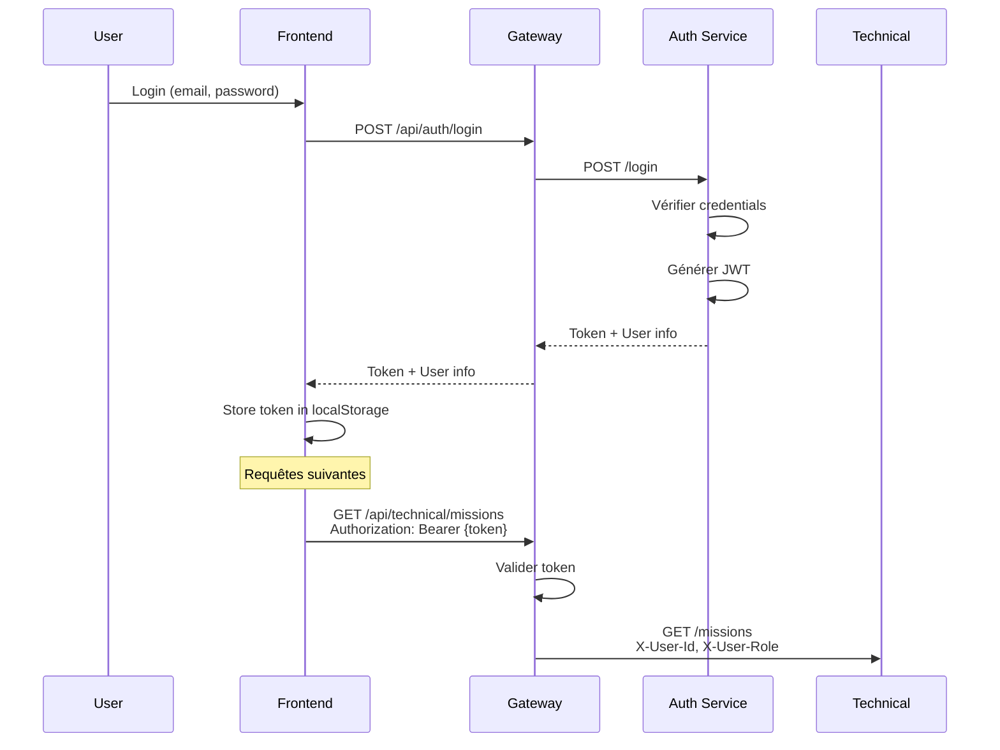

# Guide d'Architecture - Parabellum ERP

## Vue d'Ensemble

Parabellum ERP utilise une architecture microservices distribuée avec les composants suivants:

### Composants Principaux

```
┌─────────────────────────────────────────────────────────────┐
│                    Frontend (Next.js)                        │
│                    Port: 3000 / 5173                         │
└────────────────────────┬────────────────────────────────────┘
                         │ HTTP/HTTPS
                         ▼
┌─────────────────────────────────────────────────────────────┐
│                    API Gateway (Express)                     │
│                    Port: 3001                                │
│  - Routage                                                   │
│  - Authentification JWT                                      │
│  - Rate Limiting                                             │
│  - CORS                                                      │
└────────┬────────┬────────┬────────┬────────┬────────┬───────┘
         │        │        │        │        │        │
         ▼        ▼        ▼        ▼        ▼        ▼
┌────────────┐┌─────────┐┌─────────┐┌─────────┐┌─────────┐
│Auth Service││Technical││Customers││Projects ││   ...   │
│Port: 4001  ││Port:4006││Port:4002││Port:4003││         │
└──────┬─────┘└────┬────┘└────┬────┘└────┬────┘└─────────┘
       │           │          │          │
       ▼           ▼          ▼          ▼
┌──────────┐┌──────────┐┌──────────┐┌──────────┐
│PostgreSQL││PostgreSQL││PostgreSQL││PostgreSQL│
│Auth DB   ││Tech DB   ││Cust DB   ││Proj DB   │
└──────────┘└──────────┘└──────────┘└──────────┘
```

## 1. Couche Client (Frontend)

### Technologies
- **Framework**: Next.js 14
- **UI**: React + TailwindCSS
- **État**: React Query / Zustand
- **HTTP**: Axios

### Responsabilités
- Interface utilisateur
- Gestion de l'état local
- Communication avec l'API Gateway
- Gestion du cache client

## 2. Couche Gateway (API Gateway)

### Technologies
- **Framework**: Express.js
- **Proxy**: http-proxy-middleware
- **Sécurité**: Helmet, CORS
- **Rate Limiting**: express-rate-limit

### Responsabilités
- Point d'entrée unique pour toutes les requêtes
- Validation des tokens JWT
- Routage vers les microservices
- Gestion des erreurs globales
- Logging centralisé
- Rate limiting et throttling

### Configuration de Routage

```javascript
/api/auth/*          → Auth Service (4001)
/api/technical/*     → Technical Service (4006)
/api/customers/*     → Customers Service (4002)
/api/projects/*      → Projects Service (4003)
/api/procurement/*   → Procurement Service (4004)
/api/communication/* → Communication Service (4005)
/api/hr/*            → HR Service (4007)
/api/billing/*       → Billing Service (4008)
```

## 3. Couche Microservices

### Principes de Conception

1. **Autonomie**: Chaque service est indépendant
2. **Responsabilité Unique**: Un service = un domaine métier
3. **Base de Données par Service**: Isolation des données
4. **Communication via API**: HTTP/REST
5. **Scalabilité Horizontale**: Possibilité de dupliquer les services

### Services Détaillés

#### Auth Service (Port 4001)
**Domaine**: Authentification et Autorisation

**Fonctionnalités**:
- Inscription / Connexion utilisateurs
- Génération et validation de tokens JWT
- Gestion des rôles et permissions
- Audit des actions utilisateurs
- Gestion des services (départements)

**Base de Données**: `parabellum_auth`

**Modèles Principaux**:
- User
- Service
- Permission
- RolePermission
- AuditLog

#### Technical Service (Port 4006)
**Domaine**: Gestion Technique

**Fonctionnalités**:
- Gestion des techniciens
- Gestion des spécialités
- Planification des missions
- Gestion des interventions
- Sorties/Retours de matériel
- Rapports d'intervention

**Base de Données**: `parabellum_technical`

**Modèles Principaux**:
- Technicien
- Specialite
- Mission
- Intervention
- TechnicienIntervention
- SortieMateriel
- RapportMission

#### Customers Service (Port 4002)
**Domaine**: Gestion Commerciale

**Fonctionnalités**:
- Gestion des clients (entreprises et particuliers)
- Adresses et contacts multiples
- Gestion des prospects
- Suivi des activités commerciales
- Pipeline de vente

**Base de Données**: `parabellum_customers`

**Modèles Principaux**:
- Customer
- CustomerAddress
- CustomerContact
- Prospect
- ProspectActivity

#### Projects Service (Port 4003)
**Domaine**: Gestion de Projets

**Fonctionnalités**:
- Gestion des projets clients
- Tâches et affectations
- Suivi du temps (timesheet)
- Calendrier et événements
- Demandes de congés
- Documents de projet

**Base de Données**: `parabellum_projects`

**Modèles Principaux**:
- ClientProject
- ProjectTask
- TimeEntry
- ProjectDocument
- CalendarEvent
- TimeOffRequest

#### Procurement Service (Port 4004)
**Domaine**: Achats et Stock

**Fonctionnalités**:
- Catalogue de produits
- Gestion des fournisseurs
- Commandes d'achat
- Gestion du stock/inventaire
- Mouvements de stock
- Alertes de rupture

**Base de Données**: `parabellum_procurement`

**Modèles Principaux**:
- Product
- Supplier
- Order
- OrderItem
- Inventory
- InventoryMovement

#### Communication Service (Port 4005)
**Domaine**: Communication et Notifications

**Fonctionnalités**:
- Envoi d'emails
- Envoi de SMS
- Notifications in-app
- Planification d'envois
- Logs de communications
- Statuts de livraison

**Base de Données**: `parabellum_communication`

**Modèles Principaux**:
- Communication
- CommunicationLog

#### HR Service (Port 4007)
**Domaine**: Ressources Humaines

**Fonctionnalités**:
- Gestion des contrats
- Calcul de paie
- Gestion des congés
- Prêts employés
- Évaluations de performance
- Gestion des déductions

**Base de Données**: `parabellum_hr`

**Modèles Principaux**:
- Contract
- Salary
- LeaveRequest
- Loan
- LoanPayment
- PerformanceReview

#### Billing Service (Port 4008)
**Domaine**: Facturation et Comptabilité

**Fonctionnalités**:
- Création de factures
- Suivi des paiements
- Relances automatiques
- Factures récurrentes
- Comptabilité générale
- Rapports financiers
- Gestion des dépenses

**Base de Données**: `parabellum_billing`

**Modèles Principaux**:
- Invoice
- InvoiceItem
- Payment
- PaymentAllocation
- RecurringInvoice
- Reminder
- Account
- AccountingEntry
- CashFlow
- Expense

## 4. Couche Données

### Stratégie de Base de Données

Chaque microservice possède sa propre base de données PostgreSQL pour garantir:
- **Isolation**: Les services ne partagent pas de données
- **Indépendance**: Changements de schéma sans impact sur les autres services
- **Scalabilité**: Possibilité de scaler individuellement
- **Résilience**: Panne d'une DB n'affecte qu'un service

### ORM - Prisma

Tous les services utilisent Prisma pour:
- Migrations versionnées
- Type safety avec TypeScript
- Requêtes optimisées
- Studio pour exploration des données

## 5. Communication Inter-Services

### Communication Synchrone (Actuelle)

Les services communiquent via HTTP/REST à travers l'API Gateway.

Exemple: Le Technical Service doit récupérer les infos d'un client:
```
Technical Service → API Gateway → Customers Service
```

### Communication Asynchrone (Future)

Pour les opérations non critiques, utilisation d'un message broker (RabbitMQ/Redis):
```
Service A → Message Queue → Service B
```

Cas d'usage:
- Notifications
- Synchronisation de données
- Événements métier

## 6. Sécurité

### Authentification JWT

```javascript
// Structure du token
{
  "id": 123,
  "email": "user@example.com",
  "role": "ADMIN",
  "serviceId": 1,
  "iat": 1705660800,
  "exp": 1706265600
}
```

### Flux d'Authentification



### Middleware d'Authentification

Toutes les routes (sauf `/auth/*`) passent par le middleware `authenticateToken`:
1. Extraction du token
2. Vérification de la signature
3. Vérification de l'expiration
4. Injection des infos utilisateur dans les headers

## 7. Déploiement

### Environnements

#### Développement (Local)
- Services sur localhost
- Bases de données Docker
- Hot reload activé

#### Staging
- Services conteneurisés
- Base de données cloud
- SSL/TLS activé

#### Production
- Kubernetes / Docker Swarm
- Load balancing
- Auto-scaling
- Monitoring (Prometheus/Grafana)
- Logs centralisés (ELK Stack)

### CI/CD Pipeline

```
Code Push → Tests → Build → Docker Image → Deploy
```

1. **Tests**: Unit + Integration tests
2. **Build**: Build des services
3. **Docker Image**: Création des images
4. **Deploy**: 
   - Staging automatique
   - Production après validation

## 8. Monitoring et Logging

### Health Checks

Chaque service expose un endpoint `/health`:
```javascript
{
  "status": "healthy",
  "timestamp": "2026-01-19T15:30:00Z",
  "service": "technical-service",
  "version": "1.0.0",
  "database": "connected"
}
```

### Logs Structurés

Format JSON pour tous les logs:
```json
{
  "level": "info",
  "message": "Mission créée",
  "service": "technical-service",
  "timestamp": "2026-01-19T15:30:00Z",
  "userId": 123,
  "data": {
    "missionId": "MIS-202601-0001"
  }
}
```

## 9. Scalabilité

### Scaling Horizontal

Possibilité de déployer plusieurs instances de chaque service:
```
Load Balancer
    ├── Technical Service Instance 1
    ├── Technical Service Instance 2
    └── Technical Service Instance 3
```

### Optimisations

1. **Caching**: Redis pour données fréquentes
2. **CDN**: Assets statiques
3. **Database Indexing**: Optimisation des requêtes
4. **Connection Pooling**: Réutilisation des connexions DB

## 10. Évolutions Futures

### Fonctionnalités Prévues
- Message Queue (RabbitMQ)
- Service Mesh (Istio)
- GraphQL Gateway
- Real-time avec WebSockets
- Analytics Service

### Nouvelles Technologies
- Event Sourcing
- CQRS Pattern
- API GraphQL
- gRPC pour communication inter-services

---

**Version**: 1.0.0  
**Date**: 19 Janvier 2026  
**Auteurs**: Équipe Architecture Parabellum
