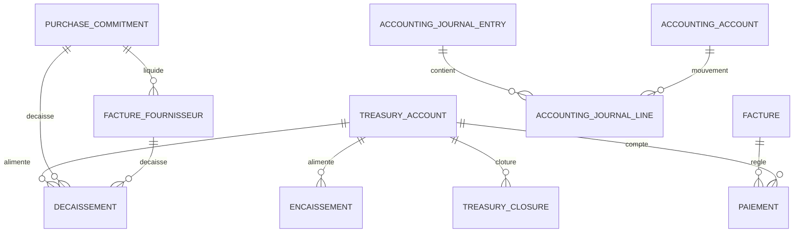
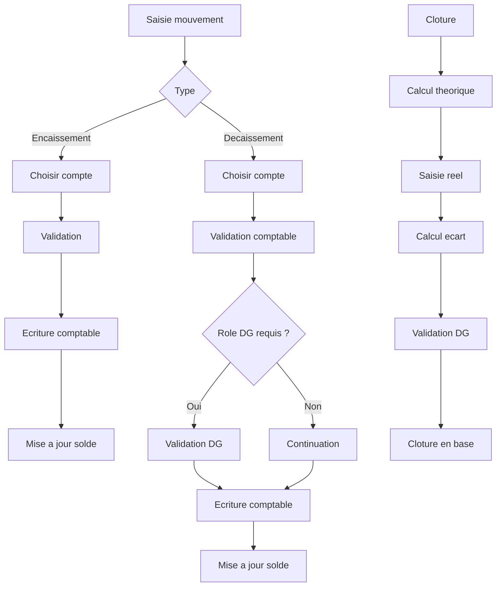
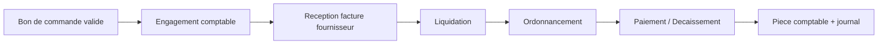

# Module Comptabilite — Rapport Technique (ParabellumGroups)

Ce document decrit le perimetre fonctionnel, les modeles de donnees (MCD/MLD),
les traitements (MCT) et le manuel d'utilisation du module Comptabilite.

---

## 1) Perimetre fonctionnel

Le module Comptabilite couvre :
- Bons de caisse (encaissements / decaissements)
- Tresorerie (suivi des flux et soldes)
- Comptes de tresorerie (banques, caisses, sous-caisses)
- Ecritures comptables (journal)
- Engagements achats → liquidation → paiement
- Clotures de caisse (periode, validation multi-roles)
- Exports PDF / Excel et impressions

---

## 2) MCD — Modele Conceptuel des Donnees

### Diagramme (Mermaid ER)

### Entites principales (resume)
- **TreasuryAccount** : compte de tresorerie (banque, caisse)
- **Encaissement** : entree de fonds
- **Decaissement** : sortie de fonds
- **TreasuryClosure** : cloture (periode, ecart, validation)
- **AccountingJournalEntry / Line** : journal comptable
- **PurchaseCommitment** : engagement achat
- **FactureFournisseur** : liquidation achat
- **Paiement** : reglement facture client
- **Facture / Devis** : pieces commerciales

---

## 3) MLD — Modele Logique des Donnees (champs exacts)

### 3.1 `treasury_accounts`
- `id` (uuid, PK)
- `name` (string)
- `type` (enum: BANK, CASH)
- `bankName` (string, nullable)
- `accountNumber` (string, nullable)
- `currency` (string, default XOF)
- `openingBalance` (float, default 0)
- `currentBalance` (float, default 0)
- `isDefault` (bool)
- `isActive` (bool)
- `createdByUserId` (string, nullable)
- `createdByEmail` (string, nullable)
- `createdAt` (datetime)
- `updatedAt` (datetime)

### 3.2 `encaissements`
- `id` (uuid, PK)
- `numeroPiece` (string, unique)
- `clientId` (string, nullable)
- `clientName` (string)
- `description` (string)
- `amountHT` (float, default 0)
- `amountTVA` (float, default 0)
- `amountTTC` (float)
- `currency` (string, default XOF)
- `paymentMethod` (enum: VIREMENT, CHEQUE, CARTE, ESPECES)
- `treasuryAccountId` (uuid, nullable)
- `dateEncaissement` (datetime)
- `reference` (string, nullable)
- `notes` (string, nullable)
- `createdByUserId` (string, nullable)
- `createdByEmail` (string, nullable)
- `createdAt` (datetime)
- `updatedAt` (datetime)
- `factureClientId` (string, nullable)

### 3.3 `decaissements`
- `id` (uuid, PK)
- `numeroPiece` (string, unique)
- `beneficiaryName` (string)
- `description` (string)
- `amountHT` (float, default 0)
- `amountTVA` (float, default 0)
- `amountTTC` (float)
- `currency` (string, default XOF)
- `paymentMethod` (enum: VIREMENT, CHEQUE, CARTE, ESPECES)
- `treasuryAccountId` (uuid, nullable)
- `dateDecaissement` (datetime)
- `reference` (string, nullable)
- `notes` (string, nullable)
- `status` (string, default VALIDE)
- `createdByUserId` (string, nullable)
- `createdByEmail` (string, nullable)
- `approvedByUserId` (string, nullable)
- `approvedByEmail` (string, nullable)
- `createdAt` (datetime)
- `updatedAt` (datetime)
- `factureFournisseurId` (uuid, nullable)
- `commitmentId` (uuid, nullable)

### 3.4 `treasury_closures`
- `id` (uuid, PK)
- `treasuryAccountId` (uuid, nullable)
- `periodType` (enum: MONTH, QUARTER, YEAR, CUSTOM)
- `periodLabel` (string, nullable)
- `periodStart` (datetime)
- `periodEnd` (datetime)
- `expectedCash` (float)
- `expectedCheque` (float)
- `expectedCard` (float)
- `expectedOther` (float)
- `expectedTotal` (float)
- `countedCash` (float)
- `countedCheque` (float)
- `countedCard` (float)
- `countedOther` (float)
- `countedTotal` (float)
- `ticketZ` (float)
- `variance` (float)
- `status` (enum: DRAFT, CLOSED, VALIDATED)
- `notes` (string, nullable)
- `createdByUserId` (string, nullable)
- `createdByEmail` (string, nullable)
- `validatedByUserId` (string, nullable)
- `validatedByEmail` (string, nullable)
- `closedAt` (datetime, nullable)
- `validatedAt` (datetime, nullable)
- `createdAt` (datetime)
- `updatedAt` (datetime)

### 3.5 `accounting_journal_entries`
- `id` (uuid, PK)
- `entryNumber` (string, unique)
- `entryDate` (datetime)
- `journalCode` (string)
- `journalLabel` (string)
- `label` (string)
- `reference` (string, nullable)
- `sourceType` (string, nullable)
- `sourceId` (string, nullable)
- `createdByUserId` (string, nullable)
- `createdByEmail` (string, nullable)
- `createdAt` (datetime)
- `updatedAt` (datetime)

### 3.6 `accounting_journal_lines`
- `id` (uuid, PK)
- `entryId` (uuid, FK → accounting_journal_entries)
- `accountId` (uuid, FK → accounting_accounts)
- `side` (enum: DEBIT, CREDIT)
- `amount` (float)
- `description` (string, nullable)
- `createdAt` (datetime)
- `updatedAt` (datetime)

### 3.7 `accounting_accounts`
- `id` (uuid, PK)
- `code` (string, unique)
- `label` (string)
- `type` (enum: ASSET, LIABILITY, EQUITY, REVENUE, EXPENSE)
- `description` (string, nullable)
- `isSystem` (bool)
- `isActive` (bool)
- `openingBalance` (float)
- `currentBalance` (float)
- `createdByUserId` (string, nullable)
- `createdByEmail` (string, nullable)
- `createdAt` (datetime)
- `updatedAt` (datetime)

### 3.8 `purchase_commitments`
- `id` (uuid, PK)
- `sourceType` (string)
- `sourceId` (string)
- `sourceNumber` (string)
- `serviceId` (int, nullable)
- `serviceName` (string, nullable)
- `supplierId` (string, nullable)
- `supplierName` (string, nullable)
- `amountHT` (float)
- `amountTVA` (float)
- `amountTTC` (float)
- `currency` (string, default XOF)
- `status` (enum: ENGAGE, LIQUIDE, ORDONNANCE, PAYE)
- `factureFournisseurId` (uuid, nullable)
- `createdAt` (datetime)
- `updatedAt` (datetime)

### 3.9 `factures_fournisseurs`
- `id` (uuid, PK)
- `numeroFacture` (string, unique)
- `fournisseurId` (string, nullable)
- `fournisseurNom` (string, nullable)
- `dateFacture` (datetime)
- `dateEcheance` (datetime, nullable)
- `montantHT` (float)
- `montantTVA` (float)
- `montantTTC` (float)
- `currency` (string, default XOF)
- `status` (string, default A_PAYER)
- `notes` (string, nullable)
- `createdAt` (datetime)
- `updatedAt` (datetime)
- `commitmentId` (uuid, nullable)

### 3.10 `paiements`
- `id` (uuid, PK)
- `factureId` (uuid, FK → factures)
- `montant` (float)
- `datePaiement` (datetime)
- `methodePaiement` (enum)
- `treasuryAccountId` (uuid, nullable)
- `reference` (string, nullable)
- `notes` (string, nullable)
- `createdAt` (datetime)
- `updatedAt` (datetime)

---

## 4) MCT — Modele Conceptuel des Traitements

### Diagramme — Flux MCT (encaissement / decaissement / cloture)

### Processus Encaissement
1. Saisie encaissement
2. Choix compte de tresorerie
3. Ecriture comptable
4. Mise a jour du solde du compte

### Processus Decaissement
1. Saisie decaissement
2. Validation comptable
3. Validation DG (si requis)
4. Ecriture comptable
5. Solde mis a jour

### Processus Cloture de caisse
1. Calcul theorique (paiements + bons de caisse)
2. Saisie reel (cash, cheque, carte)
3. Calcul ecart
4. Validation DG
5. Cloture en base

### Processus Engagement → Liquidation → Paiement
1. Engagement a la validation du BC
2. Liquidation a la facture fournisseur
3. Ordonnancement (validation)
4. Paiement (decaissement + ecriture)

### Diagramme — Cycle achats (Engagement → Liquidation → Paiement)

---

## 5) Fiche technique
- **Backend** : `services/billing-service`
- **ORM** : Prisma
- **DB** : PostgreSQL
- **API** : REST `/api/billing/*`
- **Front** : Next.js `/dashboard/comptabilite/*`
- **Exports** : PDF + Excel

---

## 6) Manuel d'utilisation (resume)

### Creer un encaissement
1. Comptabilite → Bons de caisse
2. Nouveau bon → Encaissement
3. Choisir compte, montant, methode
4. Valider

### Creer un decaissement
1. Comptabilite → Bons de caisse
2. Nouveau bon → Decaissement
3. Choisir compte, montant, methode
4. Validation comptable puis DG

### Cloturer la caisse
1. Comptabilite → Tresorerie
2. Creer cloture
3. Saisir montant reel (cash/cheque/carte)
4. Valider cloture

### Export journal
1. Comptabilite → Tresorerie / Journal
2. Filtrer (compte + periode/cloture)
3. Export PDF / Excel

---

## 7) Couverture fonctionnelle
- Encaissements / Decaissements : OK
- Comptes de tresorerie multi-banques : OK
- Cloture par periode : OK
- Journal comptable : OK
- Engagements achat → liquidation → paiement : OK
