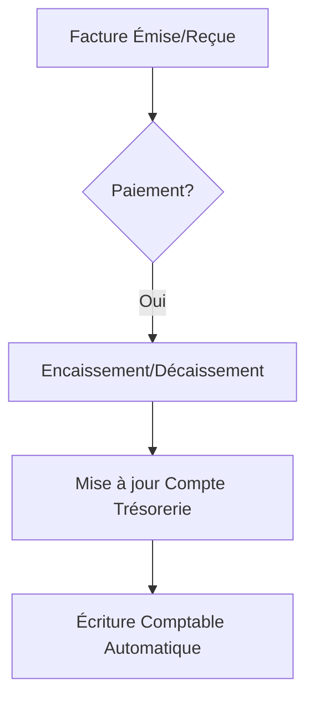
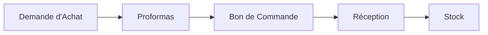
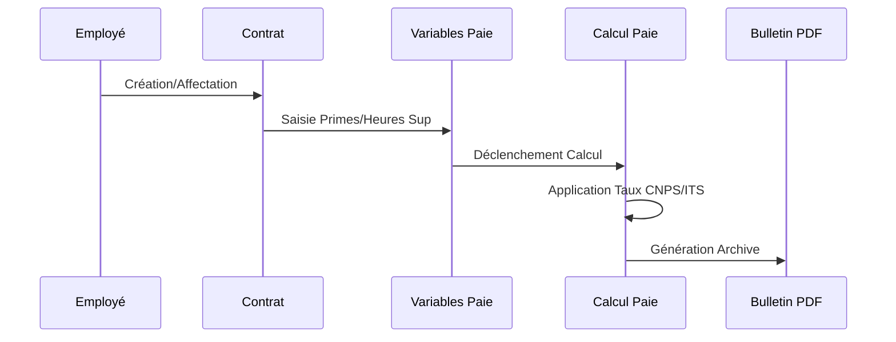

# Rapport d'Analyse Fonctionnelle et Technique : ParabellumGroups ERP

## 1. SOMMAIRE

1. [OBJET](#2-objet)
2. [CONTEXTE ET PRÉSENTATION DU PROJET](#3-contexte-et-présentation-du-projet)
3. [SYNTHÈSE DES PROCESSUS MÉTIERS](#4-synthèse-des-processus-métiers)
4. [DESCRIPTION DES SYSTÈMES ACTUELS](#5-description-des-systèmes-actuels)
5. [EXIGENCES FONCTIONNELLES DE L’ERP](#6-exigences-fonctionnelles-de-lerp)
6. [EXIGENCES TECHNIQUES DE L’ERP PROPOSÉ](#7-exigences-techniques-de-lerp-proposé)
7. [AUTRES EXIGENCES](#8-autres-exigences)
8. [DESCRIPTION DES PRESTATIONS ATTENDUES](#9-description-des-prestations-attendues)
9. [FONCTIONNELLES DÉTAILLÉES PAR MODULE](#10-fonctionnelles-détaillées-par-module)
10. [ANNEXE](#11-annexe)

---

## 2. OBJET

Ce document définit les exigences fonctionnelles et techniques de la plateforme **ParabellumGroups ERP**. Il sert de base pour la conception, le développement et la mise en œuvre d'un système de gestion intégré modulaire visant à centraliser les activités supports (Comptabilité, RH, Achats, CRM, etc.) au sein d'une infrastructure unique, sécurisée et évolutive.

---

## 3. CONTEXTE ET PRÉSENTATION DU PROJET

### 3.1. Présentation
**ParabellumGroups ERP** est une solution logicielle moderne basée sur une architecture microservices. Elle est conçue pour répondre aux défis de croissance des entreprises modernes en automatisant les processus répétitifs et en offrant une visibilité en temps réel sur les performances de chaque département.

### 3.2. Contexte et objectifs du projet
Le projet s'inscrit dans une démarche de transformation digitale visant à :
- **Fédérer les données** : Éliminer les silos d'information entre les départements commerciaux, RH et financiers.
- **Optimiser les flux financiers** : Garantir une traçabilité totale des encaissements, décaissements et engagements budgétaires.
- **Digitaliser la gestion RH** : Passer d'une gestion manuelle/Excel à une automatisation complète de la paie conforme aux normes locales (CI).
- **Améliorer la relation client** : Centraliser les contacts et opportunités pour un suivi commercial proactif.

---

## 4. SYNTHÈSE DES PROCESSUS MÉTIERS COUVERTS

Le projet ERP couvre les domaines critiques suivants :

### 4.1. Gestion comptable, Trésorerie et Budget
L'ERP automatise l'enregistrement des écritures à partir des factures (clients/fournisseurs) et des mouvements de caisse.
- **Flux de Trésorerie** :

### 4.2. Gestion des Achats et Logistique
Centralisation des demandes jusqu'à la réception physique des articles.

### 4.3. Gestion des Ressources Humaines (SIRH)
Gestion du cycle de vie des collaborateurs et de la paie conforme.

### 4.4. Gestion de la Relation Client (CRM)
Suivi complet des prospects, clients et interactions.

---

## 5. DESCRIPTION DES SYSTÈMES ACTUELS

Le système est basé sur une architecture en **microservices** hautement découplés :
- **Frontend** : Next.js 14 (App Router) avec Tailwind CSS et Shadcn UI pour une interface premium.
- **Backend API Gateway** : Point d'entrée unique gérant le routage, l'authentification et les quotas.
- **Services** : 12 microservices spécialisés (Auth, HR, Billing, Procurement, Inventory, Customer, Project, etc.).
- **Persistance** : PostgreSQL (instances séparées par service via Docker).
- **Stockage** : MinIO pour le stockage d'objets (S3 compatible) pour les documents et rapports.

---

## 6. EXIGENCES FONCTIONNELLES DE L’ERP

### 6.1. Gestion comptable et Placements
- **Écritures automatiques** : Génération des journaux à partir des ventes et achats.
- **Suivi des Placements** : Visualisation du portefeuille de titres (Actions, Obligations) et valorisation en temps réel.

### 6.2. Gestion de la Trésorerie et e-Caisse
- **Multi-caisses** : Gestion de la caisse principale et des menues dépenses (Cash Vouchers).
- **Rapprochement** : Clôtures périodiques et suivi des écarts.

### 6.3. Gestion des RH (SIRH)
- **Calcul Paie** : Moteur de calcul automatisé (IGR, CNPS, ITS, CMU).
- **Documents RH** : Génération automatique des contrats, attestations et bulletins PDF.

---

## 7. EXIGENCES TECHNIQUES DE L’ERP PROPOSÉ

- **Sécurité** : Chiffrement des mots de passe (Bcrypt), communications sécurisées via JWT.
- **Scalabilité** : Déploiement via Docker Compose permettant de monter en charge les services critiques séparément.
- **Haute Disponibilité** : Utilisation de Redis pour le cache et les files d'attente de messages.

---

## 8. FONCTIONNELLES DÉTAILLÉES PAR MODULE

### 8.1. Système de gestion RH (hr-service)
Le module RH repose sur le modèle **LOGIPAIE_RH** permettant une gestion fine de la législation ivoirienne.
- **Modèles de données** : `Employe`, `Contrat`, `VariableMensuelle`, `BulletinPaie`.
- **Workflows** : Processus d'embauche -> Saisie mensuelle -> Calcul -> Validation -> Paiement (Virement/Espèces).

### 8.2. Système de gestion des Achats (procurement-service)
- **Circuit d'approbation** : Flow de validation multi-niveaux pour les Demandes d'Achat.
- **Comparaison de Proformas** : Analyse comparative des offres fournisseurs avant validation du Bon de Commande.

### 8.3. Système CRM (customer-service)
- **Cycle de Vente** : Pipeline visuel des opportunités.
- **360° Client** : Historique complet des interactions (appels, emails, réunions) et documents liés.

### 8.4. Comptabilité, Budget et Analytique (billing-service)
- **Modèle Budgétaire** : Allocation par centres analytiques (`AnalyticCenter`) et suivi des versions de budget.
- **Plan Comptable** : Intégrité des comptes (`AccountingAccount`) avec mapping automatique des flux métiers.

### 8.5. Trésorerie et e-Caisse (billing-service)
- **Encaissements/Décaissements** : Suivi des flux réels par rapport aux engagements.
- **Gestion des Placements** : Consolidation du portefeuille d'actions et obligations.

### 8.6. Stocks et Patrimoine (inventory-service)
- **Mouvements de Stocks** : Traçabilité des entrées/sorties et alertes sur seuils de rupture.
- **Inventaire** : Procédure de régularisation des stocks réels vs théoriques.
- **Immobilisations** : Suivi des équipements et planification de la maintenance préventive/corrective.

### 8.7. GED et Courrier (communication / customer service)
- **Archivage Digital** : Centralisation des contrats et documents clients avec gestion des versions.
- **Flux Courrier** : Gestion des messages (Email/SMS) et campagnes marketing groupées.

---

## 9. DESCRIPTION DES PRESTATIONS ATTENDUES

### 9.1. Mise en œuvre de la solution
- Installation de la stack Docker sur les serveurs de production.
- Migration des données existantes (depuis Excel ou anciens systèmes).

### 9.2. Délai d'exécution et Livraison
- Livraison itérative par module (Approche Agile).
- Fourniture des manuels utilisateurs et documentation technique (OpenAPI).

### 9.3. Équipe et Support
- Mise à disposition d'une équipe de développeurs fullstack et d'un chef de projet.
- Support technique post-déploiement et maintenance évolutive.

---

## 10. ANNEXE

### 9.1. Cartographie fonctionnelle
L'ERP est structuré en modules indépendants communiquant via des APIs REST synchrones (via Gateway) et asynchrones (via évènements).

### 9.2. Analyse des processus "support"
Chaque processus (Comptabilité, Budget, Patrimoine) possède son propre schéma de données isolé, garantissant l'intégrité et la confidentialité des informations sensibles.

git add -A 
git commit -m "adaptation du modèle et du flux client sur le backend et le frontend: Client utilise désormais idu, ncc, rccm, codeActivite et fax, SecteurActivite passe en codeActivite @map("codeNAF"), et l’adresse client est pensée CI avec quartier, rue/résidence, repère visuel, BP, commune, district, GPS et infos d’accès. J’ai aussi ajouté la migration migration.sql et aligné les defaults CRM dans schema.prisma sur Africa/Abidjan et XOF."
git push origin main