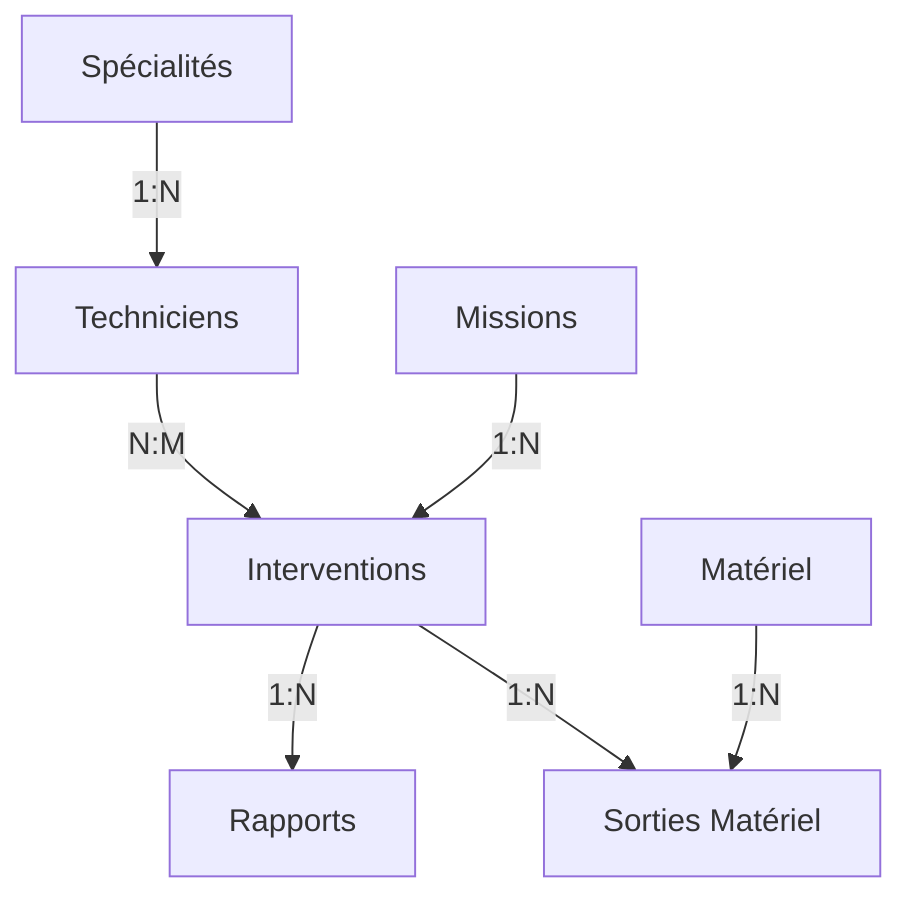
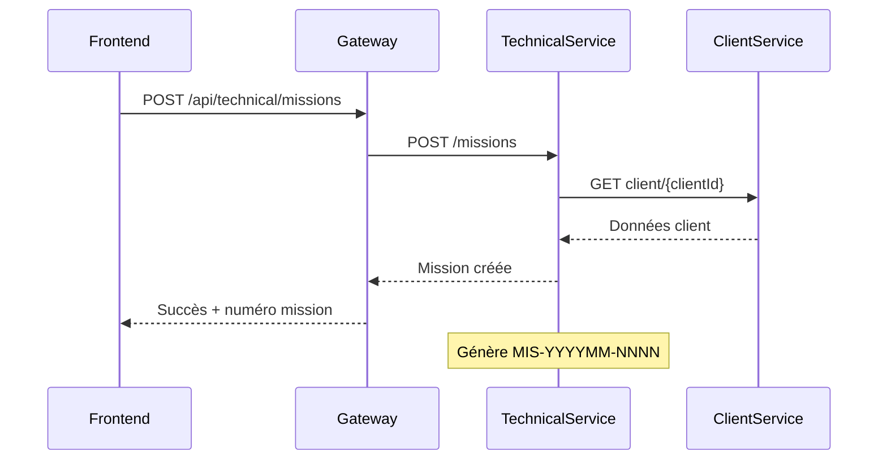

# Documentation Technique - Service Technique Parabellum ERP

## 📋 Table des Matières

1. [Introduction](#introduction)
2. [Architecture du Service](#architecture-du-service)
3. [API Endpoints](#api-endpoints)
4. [Modèles de Données](#modèles-de-données)
5. [Intégration Frontend](#intégration-frontend)
6. [Workflows Principaux](#workflows-principaux)
7. [Exemples de Code](#exemples-de-code)
8. [Dépannage](#dépannage)

## 1. Introduction

### 1.1 Présentation du Service

Le Service Technique est un microservice dédié à la gestion des interventions techniques pour Parabellum ERP. Il gère :

- 🛠️ Les techniciens et leurs compétences
- 📋 Les missions d'intervention
- 🔧 Le matériel et le stock
- 📊 Les rapports d'intervention

### 1.2 Technologies Utilisées

- **Backend** : Node.js + Express.js
- **Base de données** : PostgreSQL + Prisma ORM
- **Authentification** : JWT (JSON Web Tokens)
- **Documentation** : Swagger/OpenAPI 3.0
- **Communication** : API Gateway centralisée

### 1.3 Ports d'accès

- **Service Direct** : http://localhost:4006
- **Via API Gateway** : http://localhost:3001/api/technical
- **Documentation** : http://localhost:4006/api-docs

## 2. Architecture du Service

### 2.1 Schéma de Base de Données



### 2.2 Modèles Principaux

#### Technicien
```javascript
{
  "id": 1,
  "nom": "Dupont",
  "prenom": "Jean",
  "contact": "jean.dupont@parabellum.com",
  "specialiteId": 1,
  "status": "AVAILABLE", // AVAILABLE, ON_MISSION, ON_LEAVE, SICK, TRAINING
  "currentMissionId": "MIS-202601-0001"
}
```

#### Mission
```javascript
{
  "numIntervention": "MIS-202601-0001",
  "natureIntervention": "Maintenance système électrique",
  "clientId": 456,
  "statut": "planifiee", // planifiee, en_cours, terminee, annulee
  "priorite": "haute", // basse, normale, haute, urgente
  "dateSortieFicheIntervention": "2026-01-20T09:00:00Z"
}
```

## 3. API Endpoints

### 3.1 Authentification

Toutes les requêtes nécessitent un token JWT :

```http
Authorization: Bearer <votre_token_jwt>
```

### 3.2 Endpoints Principaux

#### Gestion des Techniciens

| Méthode | Endpoint | Description | Rôle Requis |
|---------|----------|-------------|-------------|
| GET | `/api/techniciens` | Liste paginée | admin, manager |
| GET | `/api/techniciens/disponibles` | Techniciens disponibles | admin, manager |
| GET | `/api/techniciens/{id}` | Détails technicien | admin, manager, technicien |
| POST | `/api/techniciens` | Créer technicien | admin, manager |
| PUT | `/api/techniciens/{id}` | Mettre à jour | admin, manager |
| PATCH | `/api/techniciens/{id}/status` | Changer statut | admin, manager |

#### Gestion des Missions

| Méthode | Endpoint | Description | Rôle Requis |
|---------|----------|-------------|-------------|
| GET | `/api/missions` | Liste missions | admin, manager |
| GET | `/api/missions/{num}` | Détails mission | admin, manager |
| POST | `/api/missions` | Créer mission | admin, manager |
| POST | `/api/missions/{num}/assign-techniciens` | Assigner techniciens | admin, manager |

#### Gestion du Matériel

| Méthode | Endpoint | Description | Rôle Requis |
|---------|----------|-------------|-------------|
| GET | `/api/materiels` | Liste matériel | admin, manager |
| POST | `/api/materiels/sortie` | Sortie matériel | admin, manager, technicien |
| POST | `/api/materiels/sortie/{id}/retour` | Retour matériel | admin, manager, technicien |
| GET | `/api/materiels/alertes` | Alertes stock | admin, manager |

### 3.3 Codes de Réponse

| Code | Signification | Exemple |
|------|--------------|---------|
| 200 | Succès | `{ "success": true, "data": {...} }` |
| 201 | Créé avec succès | `{ "success": true, "message": "Créé" }` |
| 400 | Erreur validation | `{ "success": false, "errors": [...] }` |
| 401 | Non authentifié | `{ "success": false, "message": "Token manquant" }` |
| 403 | Accès refusé | `{ "success": false, "message": "Rôle insuffisant" }` |
| 404 | Non trouvé | `{ "success": false, "message": "Ressource non trouvée" }` |
| 500 | Erreur serveur | `{ "success": false, "message": "Erreur interne" }` |

## 4. Modèles de Données

Voir le fichier `prisma/schema.prisma` pour la définition complète des modèles.

### Principales relations:
- Un **Technicien** a une **Spécialité**
- Une **Mission** peut avoir plusieurs **Interventions**
- Une **Intervention** peut avoir plusieurs **Techniciens** (relation N:M)
- Une **Intervention** peut avoir plusieurs **Sorties de Matériel**
- Une **Intervention** peut avoir plusieurs **Rapports**

## 5. Intégration Frontend

### 5.1 Configuration Axios

```javascript
// src/services/api.js
import axios from 'axios';

const apiClient = axios.create({
  baseURL: 'http://localhost:3001/api/technical', // Via Gateway
  timeout: 10000,
  headers: {
    'Content-Type': 'application/json',
  }
});

// Intercepteur pour ajouter le token
apiClient.interceptors.request.use(
  (config) => {
    const token = localStorage.getItem('access_token');
    if (token) {
      config.headers.Authorization = `Bearer ${token}`;
    }
    return config;
  },
  (error) => Promise.reject(error)
);

export default apiClient;
```

### 5.2 Service des Techniciens

```javascript
// src/services/technicienService.js
import apiClient from './api';

export const TechnicienService = {
  getAll: async (page = 1, limit = 20, filters = {}) => {
    const params = { page, limit, ...filters };
    const response = await apiClient.get('/techniciens', { params });
    return response.data;
  },

  getAvailable: async () => {
    const response = await apiClient.get('/techniciens/disponibles');
    return response.data;
  },

  create: async (technicienData) => {
    const response = await apiClient.post('/techniciens', technicienData);
    return response.data;
  },

  update: async (id, technicienData) => {
    const response = await apiClient.put(`/techniciens/${id}`, technicienData);
    return response.data;
  }
};
```

## 6. Workflows Principaux

### 6.1 Création d'une Mission



### 6.2 Sortie de Matériel

```javascript
// Workflow complet
async function workflowSortieMateriel() {
  // 1. Vérifier disponibilité
  const disponibilite = await MaterialService.checkAvailability(
    materielId,
    quantite
  );

  if (!disponibilite.available) {
    throw new Error(`Stock insuffisant. Disponible: ${disponibilite.quantity}`);
  }

  // 2. Créer la sortie
  const sortie = await MaterialService.sortie({
    materielId,
    interventionId,
    technicienId,
    quantite,
    notes: 'Pour intervention'
  });

  // 3. Mettre à jour le stock
  await MaterialService.updateStock(materielId, -quantite);

  return sortie;
}
```

## 7. Exemples de Code

### 7.1 Hook React pour les Techniciens

```javascript
// src/hooks/useTechniciens.js
import { useState, useEffect, useCallback } from 'react';
import { TechnicienService } from '../services/technicienService';

const useTechniciens = (initialFilters = {}) => {
  const [techniciens, setTechniciens] = useState([]);
  const [loading, setLoading] = useState(false);
  const [error, setError] = useState(null);
  const [filters, setFilters] = useState(initialFilters);

  const loadTechniciens = useCallback(async (page = 1) => {
    setLoading(true);
    setError(null);
    
    try {
      const response = await TechnicienService.getAll(page, 10, filters);
      setTechniciens(response.data);
    } catch (err) {
      setError(err.message || 'Erreur de chargement');
    } finally {
      setLoading(false);
    }
  }, [filters]);

  useEffect(() => {
    loadTechniciens();
  }, [loadTechniciens]);

  return {
    techniciens,
    loading,
    error,
    filters,
    loadTechniciens,
    setFilters
  };
};

export default useTechniciens;
```

## 8. Dépannage

### Erreur 401 - Non Authentifié

```javascript
// Vérifier :
// 1. Token présent dans localStorage
const token = localStorage.getItem('access_token');

// 2. Token non expiré
function isTokenValid(token) {
  try {
    const payload = JSON.parse(atob(token.split('.')[1]));
    return payload.exp * 1000 > Date.now();
  } catch {
    return false;
  }
}
```

### Erreur de Connexion au Service

```powershell
# Vérifier que le service est démarré
docker-compose ps technical-service

# Voir les logs
docker-compose logs -f technical-service

# Redémarrer le service
docker-compose restart technical-service
```

### Erreurs de Base de Données

```powershell
# Vérifier la connexion
docker-compose exec postgres-technical psql -U postgres -d parabellum_technical

# Réappliquer les migrations
cd services/technical-service
npx prisma migrate reset
npx prisma migrate dev
```

---

**Version** : 1.0.0  
**Dernière mise à jour** : 19 Janvier 2026  
**Auteurs** : Équipe Technique Parabellum  
**Contact** : support@parabellum.com
